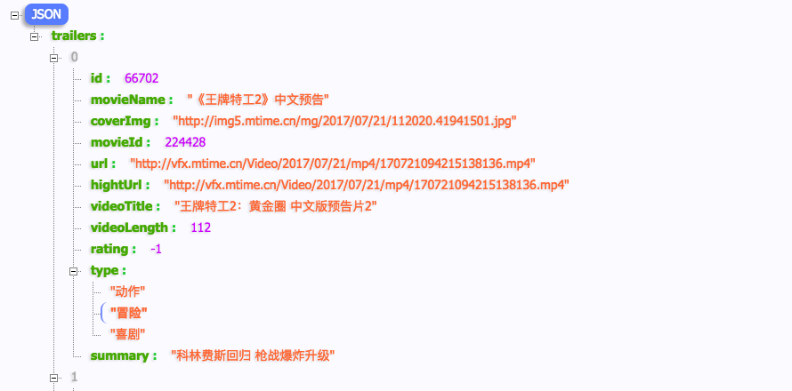

[TOC]


# 1.联网操作及相关框架


## 1. 原生联网请求
> HttpUrlConnection

使用

- 1.开启分线程执行联网操作
    + 根据请求地址str获取请求地址URL
    + 获取连接`connection = URL url.openConnection()`
    + 设置connection
        * RequestMethod
        * setConnectTimeout
        * setReadTimeout
    + 获取响应码,并判断是否请求数据成功(==200)`connection.getResponseCode()`
        * 获取响应流`connection.getInputStream()`
        * 读写向应流
            - 使用二进制字节流,读写输入输出
            - 使用字符流读写输入输出
        * 显示响应结果(UI线程)
- 2.开启UI线程,更新界面


> 方式一:使用 BufferedReader读写输入输出流


```java
    private void sendRequestWithHttpURLConnection() {
        // 开启线程来发起网络请求
        new Thread(new Runnable() {
            @Override
            public void run() {
                HttpURLConnection connection = null;
                BufferedReader reader = null;
                try {
                    URL url = new URL("http://www.baidu.com");//请求地址
                    connection = (HttpURLConnection) url.openConnection();
                    connection.setRequestMethod("GET");
                    connection.setConnectTimeout(8000);
                    connection.setReadTimeout(8000);

                    //应判断响应码是否为 200: 表示请求数据成功    

                    InputStream in = connection.getInputStream();//
                    // 下面对获取到的输入流进行读取
                    reader = new BufferedReader(new InputStreamReader(in));//读取请求内容
                    StringBuilder response = new StringBuilder();
                    String line;
                    while ((line = reader.readLine()) != null) {
                        response.append(line);
                    }
                    showResponse(response.toString());
                } catch (Exception e) {
                    e.printStackTrace();
                } finally {
                    if (reader != null) {
                        try {
                            reader.close();
                        } catch (IOException e) {
                            e.printStackTrace();
                        }
                    }
                    if (connection != null) {
                        connection.disconnect();
                    }
                }
            }
        }).start();
    }
```

```java
 /**
     * 显示响应结果
     * @param response
     */
    private void showResponse(final String response) {
        runOnUiThread(new Runnable() {
            @Override
            public void run() {
                // 在这里进行UI操作，将结果显示到界面上
                responseText.setText(response);
            }
        });
    }
```


> 方式二: 使用二进制字节流,读写输入输出

```java
/**
     * 开启子线程,执行联网操作
     * @throws IOException
     */
    private void buttonFunction() throws IOException {
        final String urlStr = "https:www.baidu.com";
        new Thread(new Runnable() {
            @Override
            public void run() {
                try {
                    URL url = new URL(urlStr);
                    HttpURLConnection connection = (HttpURLConnection) url.openConnection();
                    //设置
                    connection.setConnectTimeout(8000);
                    connection.setRequestMethod("GET");
                    connection.setReadTimeout(5000);
                    int code = connection.getResponseCode();
                    if(code==200) {//响应码为200表示响应成功
                        InputStream in = connection.getInputStream();//获取输入流
                        // /转换为二进制输出流(此处使用字节流读写)
                        ByteArrayOutputStream bos = new ByteArrayOutputStream();/
                        byte[] buffer = new byte[1024];
                        int len = 0;
                        while ((len = in.read(buffer))>0){
                            bos.write(buffer,0,len);
                        }
                        showResponse(bos);
                    }
                } catch (ProtocolException e) {
                    e.printStackTrace();
                } catch (MalformedURLException e) {
                    e.printStackTrace();
                } catch (IOException e) {
                    e.printStackTrace();
                }
            }
        }).start();
    }
    /**
     * 将输出流转换为string 结果
     * @param bos
     * @throws UnsupportedEncodingException
     */
    private void showResponse(ByteArrayOutputStream bos) throws UnsupportedEncodingException {
        final String result = bos.toString("utf-8");
        //开启UI线程,更新界面
        runOnUiThread(new Runnable() {
            @Override
            public void run() {
                tvInfo.setText(result);
            }
        });
    }
```


## 2. android-async-http()
> github地址: https://github.com/loopj/android-async-http

- 说明:使用HttpClient封装(Android6.0完全废弃已经废弃),故仅作了解,不推荐使用


> 特点: 如下就是android-async-http的特性

- 发送异步http请求，在匿名callback对象中处理response信息；
- http请求发生在UI（主）线程之外的异步线程中；
- 内部采用线程池来处理并发请求；
- 通过RequestParams类构造GET/POST；
- 内置多部分文件上传，不需要第三方库支持；
- 流式Json上传，不需要额外的库；
- 能处理环行和相对重定向；
- 和你的app大小相比来说，库的size很小，所有的一切只有90kb；
- 在各种各样的移动连接环境中具备自动智能请求重试机制；
- 自动的gzip响应解码；
- 内置多种形式的响应解析，有原生的字节流，string，json对象，甚至可以将response写到文件中；
- 永久的cookie保存，内部实现用的是Android的SharedPreferences；
- 通过BaseJsonHttpResponseHandler和各种json库集成；
- 支持SAX解析器；
- 支持各种语言和content编码，不仅仅是UTF-8；

> 使用

- 添加依赖库`compile 'com.loopj.android:android-async-http:1.4.9'`


> 发送GET请求

```java
    private String url = "http://api.m.mtime.cn/PageSubArea/TrailerList.api";
    private static  AsyncHttpClient client = new AsyncHttpClient();

    private void asyncGet() {
        client.get(url, null, new AsyncHttpResponseHandler() {
            @Override
            public void onSuccess(int statusCode, Header[] headers, byte[] responseBody) {
                String result =  new String(responseBody);
                tvAsyncInfo.setText("StatusCode:"+statusCode);
                tvAsyncInfo.append("\nResponseBody:"+result);
            }
            @Override
            public void onFailure(int statusCode, Header[] headers, byte[] responseBody, Throwable error) {
                tvAsyncInfo.setText("联网失败:"+statusCode);
            }
        });
    }
```

> 发送POST请求

```java
    private String url = "http://api.m.mtime.cn/PageSubArea/TrailerList.api";
    private static  AsyncHttpClient client = new AsyncHttpClient();
    private void btAsyncPost() {
        RequestParams params = new RequestParams();
        client.post(url, params, new AsyncHttpResponseHandler() {
            @Override
            public void onSuccess(int statusCode, Header[] headers, byte[] responseBody) {
                tvAsyncInfo.setText("POST"+new String(responseBody));//获取请求体
            }
            @Override
            public void onFailure(int statusCode, Header[] headers, byte[] responseBody, Throwable error) {
                tvAsyncInfo.setText("POST_ERROR:"+new String(error.getMessage()));
            }
        });
    }
```


## 3.okhttp
> 地址:http://square.github.io/okhttp/   

- 添加jar包
    + okio-1.13.0.jar
    + okhttp-3.9.0.jar

> 使用:
1. 联网请求需要在分线程执行
2. 添加联网权限

- GET 请求

```java
    /**
     * 使用okhttpGet
     */
    private void okhttpGet() throws IOException {
        Toast.makeText(this, "OKHTTP", Toast.LENGTH_SHORT).show();
        new Thread(new Runnable() {
            @Override
            public void run() {
                try {
                    OkHttpClient client = new OkHttpClient();
                    Request request = new Request.Builder()
                            .url(urlStr)
                            .build();
                    Response response = client.newCall(request).execute();
                    String result = response.body().string();
                    showResponse(result);//显示更新(或者使用handler)
                } catch (IOException e) {
                    e.printStackTrace();
                }
            }
        }).start();
    }
```

```java
    /**
     * 显示更新
     *
     * @param result
     */
    private void showResponse(final String result) {
        runOnUiThread(new Runnable() {
            @Override
            public void run() {
                tvInfo.setText(result);
            }
        });
    }
```


- POST请求

```java
    @OnClick(R.id.bt_okhttp_post)
    public void postOnclik() {
        tvResposeInfo.setText("");//清空数据
        new Thread() {
            @Override
            public void run() {
                try {
                    String result = okHttpPost(url, "");//调用okhttp post方法
                    if (result != null) {
                        Message msg = Message.obtain();
                        msg.what = POST;
                        msg.obj = result;//msg携带数据
                        handler.sendMessage(msg);//使用handler发送消息更新界面
                    }
                } catch (IOException e) {
                    e.printStackTrace();
                }
            }
        }.start();
    }
```

```java
    /**
     * POST:二次封装
     *
     * @param url
     * @param json
     * @return
     * @throws IOException
     */
    public static final MediaType JSON = MediaType.parse("application/json; charset=utf-8");
    String okHttpPost(String url, String json) throws IOException {
        RequestBody body = RequestBody.create(JSON, json);
        Request request = new Request.Builder()
                .url(url)
                .post(body)
                .build();
        Response response = client.newCall(request).execute();
        return response.body().string();
    }
```


> handler操作 

```java

    private Handler handler = new Handler() {
        @Override
        public void handleMessage(Message msg) {
            switch (msg.what) {
                case GET:
                    String result = (String) msg.obj;
                    tvResposeInfo.setText(result);
                    break;
                case POST:
                    tvResposeInfo.setText((String) msg.obj);//msg中取出数据
                    break;
                case DOWNLOAD_FILE_SUCCESS:
                    tvResposeInfo.setText("下载文件成功");
                    break;
                case UPDATE_PROGRESS:
                    String  info = (String) msg.obj;
                    tvResposeInfo.setText(info);
                    break;
            }

        }
    };
```


- 文件下载

```java
    /**
     * 文件下载
     *
     * @param view
     */
    @OnClick(R.id.bt_okhttp_download)
    public  void downLoad(View view) {
//        final String url = App.list.get(1).getHightUrl();// 获取视频地址
        final String url = "http://vf2.mtime.cn/Video/2017/08/02/mp4/170802074323236656.mp4";// 获取视频地址
        new Thread(new Runnable() {
            @Override
            public void run() {
                try {
                    Request request = new Request.Builder()
                            .url(url)
                            .build();
                    Response response;
                    response = client.newCall(request).execute();
                    if (response != null) {
                        InputStream inputStream = response.body().byteStream();//获取输入流
                        long total = response.body().contentLength();
                        String dir = Environment.getExternalStoragePublicDirectory(Environment.DIRECTORY_DOWNLOADS).getPath();
                        String fileName = url.substring(url.lastIndexOf("/"));
                        File file = new File(dir+fileName);//创建输出文件
                        FileOutputStream out = new FileOutputStream(file);//创建输出流
                        int len;
                        long locla = 0;
                        byte[] buffer = new byte[1024];
                        while ((len = inputStream.read(buffer))!=-1) {
                            out.write(buffer,0,len);
                            locla+=len;
                            Message msg = Message.obtain();
                            msg.what = UPDATE_PROGRESS;
                            msg.obj = locla+"/"+total;
                            handler.sendMessage(msg);
                        }
                        if(inputStream!=null) {
                            inputStream.close();
                        }
                        if(out!=null) {
                            out.close();
                        }
                        handler.sendEmptyMessage(DOWNLOAD_FILE_SUCCESS);//handler消息,提示下载完成(更新进度)
                    }
                } catch (IOException e) {
                    e.printStackTrace();
                }
            }
        }).start();
    }
```

>  handler 更新下载进度

```java
    private Handler handler = new Handler() {
        @Override
        public void handleMessage(Message msg) {
            switch (msg.what) {
                ....
                case DOWNLOAD_FILE_SUCCESS:
                    tvResposeInfo.setText("下载文件成功");
                    break;
                case UPDATE_PROGRESS:
                    String  info = (String) msg.obj;
                    tvResposeInfo.setText(info);
                    break;
            }

        }
    };
```
    


## 4.OkhttpUtils

> 说明:对okhttp的封装类(由于个人原因，现已停止维护),了解

- ` compile 'com.zhy:okhttputils:2.6.2'`

> 使用


- get 请求文本

```java
    /**
     * 发送GET请求
     *
     * @param view
     */
    @OnClick(R.id.bt_okhttp_get)
    public void getOnclick(View view) {
        tvResposeInfo.setText("get");//清空数据
        // String url2 = "http://www.csdn.net/"
        OkHttpUtils
                .get()
                .url(url)
                //.addParams("username", "hyman")
                //.addParams("password", "123")
                .build()
                .execute(new MyStringCallback());
    }
```

```java
//请求回调
    public class MyStringCallback extends StringCallback {
        @Override
        public void onBefore(Request request, int id) {
            setTitle("loading...");
        }
        @Override
        public void onAfter(int id) {
            setTitle("Sample-okHttp");
        }
        @Override
        public void onError(Call call, Exception e, int id) {
            e.printStackTrace();
            tvResposeInfo.setText("onError:" + e.getMessage());
        }
        @Override
        public void onResponse(String response, int id) {
            tvResposeInfo.setText("onResponse:\n" + response);
            switch (id) {
                case 100:
                    Toast.makeText(OkHttpUtilsActivity.this, "http", Toast.LENGTH_SHORT).show();
                    break;
                case 101:
                    Toast.makeText(OkHttpUtilsActivity.this, "https", Toast.LENGTH_SHORT).show();
                    break;
            }
        }
        @Override
        public void inProgress(float progress, long total, int id) {
//            Log.e(TAG, "inProgress:" + progress);
//            mProgressBar.setProgress((int) (100 * progress));
        }
    }
```

- post 请求文本

```java

    /**
     * OkHttpUtils 发送POST请求
     */
    @OnClick(R.id.bt_okhttp_post)
    public void postOnclik() {
        tvResposeInfo.setText("");

        OkHttpUtils
                .post()
                .url(url)
                .addParams("username", "hyman")
                .addParams("password", "123")
                .build()
                .execute(new MyStringCallback());

    }
```


- 下载文件

```java
    /**
     * 下载大文件
     *
     * @param v
     */
    @OnClick(R.id.bt_file_download)
    public void downloadOnclick(View v) {
        tvResposeInfo.setText("download");
        String fileUrl = "http://vfx.mtime.cn/Video/2017/08/02/mp4/170802074323236656.mp4";
        String fileDir = Environment.getExternalStorageDirectory().getAbsolutePath();
        String fileName = "okhttp_utils_dowload.mp4";
        OkHttpUtils
                .get() //
                .url(fileUrl)//
                .build()//
                .execute(new FileCallBack(fileDir, fileName)//
                {
                    @Override
                    public void onBefore(Request request, int id) {
                    }
                    @Override
                    public void inProgress(float progress, long total, int id) {
                        pbFileDownload.setProgress((int) (100 * progress));
                        int percent = (int) (progress * 100);
                        tvResposeInfo.setText("进度:" + percent + "%");
                        Log.e(TAG, "inProgress :" + (int) (100 * progress));
                    }
                    @Override
                    public void onError(Call call, Exception e, int id) {
                        Log.e(TAG, "onError :" + e.getMessage());
                    }
                    @Override
                    public void onResponse(File file, int id) {
                        Log.e(TAG, "onResponse :" + file.getAbsolutePath());
                    }
                });
    }
```


- 文件上传(支持多文件上传)

```java
    /**
     * 文件上传
     *
     * @param v
     */
    @OnClick(R.id.bt_file_upload)
    public void uploadOnclick(View v) {
        String baseUrl = "http://192.168.1.104:8080/FileUpload/FileUploadServlet";//文件上传服务器
        File file = new File(Environment.getExternalStorageDirectory() + "/Download", "test.png");
        File textFile = new File(Environment.getExternalStorageDirectory() + "/Download", "test.txt");
        Log.d(TAG, file.getAbsolutePath().toString());
        multiFileUpload(baseUrl, file, textFile);//多文件上传
    }
```

```java

    /**
     * 多文件上传方法
     *
     * @param basurl
     * @param file1
     * @param file2
     */
    public void multiFileUpload(String basurl, File file1, File file2) {

        if (!file1.exists() || !file2.exists()) {
            Toast.makeText(OkHttpUtilsActivity.this, "文件不存在，请修改文件路径", Toast.LENGTH_SHORT).show();
            return;
        }

        Map<String, String> params = new HashMap<>();
        params.put("username", "张鸿洋");
        params.put("password", "123");

        OkHttpUtils.post()//
                .addFile("mFile", "server.png", file1)//
                .addFile("mFile", "server.txt", file2)//
                .url(basurl)
                .params(params)//
                .build()//
                .execute(new MyStringCallback());
    }

```

- 下载图片
```java
    /**
     * 下载图片:方法
     *
     * @param
     */
    public void getImage(String imgUrl) {
        tvResposeInfo.setText("");
        OkHttpUtils
                .get()//
                .url(imgUrl)//
                .tag(this)//
                .build()//
                .connTimeOut(20000)
                .readTimeOut(20000)
                .writeTimeOut(20000)
                .execute(new BitmapCallback() {
                    @Override
                    public void onError(Call call, Exception e, int id) {
                        tvResposeInfo.setText("onError:" + e.getMessage());
                    }
                    @Override
                    public void onResponse(Bitmap bitmap, int id) {
                        Log.e("TAG", "onResponse：complete");
                        ivOkhttp.setImageBitmap(bitmap);
                    }
                });
    }
```

- 其它okhttp封装库`https://github.com/jeasonlzy/okhttp-OkGo`


## 5.xUtils3
> 地址:https://github.com/wyouflf/xUtils3

- xUtils3简介
xUtils 包含了orm, http(s), image, view注解, 但依然很轻量级(246K), 并且特性强大, 方便扩展:
稳定的基石: AbsTask和统一的回调接口Callback, 任何异常, 即使你的回调方法实现有异常都会进入onError, 任何情况下onFinished总会让你知道任务结束了.
基于高效稳定的orm工具, http模块得以更方便的实现cookie(支持domain, path, expiry等特性)和 缓存(支持Cache-Control, Last-Modified, ETag等特性)的支持.
有了强大的http及其下载缓存的支持, image模块的实现相当的简洁, 并且支持回收被view持有, 但被Mem Cache移除的图片, 减少页面回退时的闪烁..
view注解模块仅仅400多行代码却灵活的支持了各种View注入和事件绑定, 包括拥有多了方法的listener的支持.

- 其他特性
支持超大文件(超过2G)上传
更全面的http请求协议支持(11种谓词)
拥有更加灵活的ORM, 和greenDao一致的性能
更多的事件注解支持且不受混淆影响...
图片绑定支持gif(受系统兼容性影响, 部分gif文件只能静态显示), webp; 支持圆角, 圆形, 方形等裁剪, 支持自动旋转...
从3.5.0开始不再包含libwebpbackport.so, 需要在Android4.2以下设备兼容webp的请使用3.4.0版本.

- 使用Gradle构建时添加一下依赖即可:`compile 'org.xutils:xutils:3.5.0'`


- 初始化
```java
// 在application的onCreate中初始化
@Override
public void onCreate() {
    super.onCreate();
    x.Ext.init(this);
    x.Ext.setDebug(BuildConfig.DEBUG); // 是否输出debug日志, 开启debug会影响性能.
    ...
}
```


### 1.GET

```java
    /**
     * 使用xutils 执行get 请求
     */
    private void xutilGet() {
        tvXutils3NetInfo.setText("");
        String url = "http://api.m.mtime.cn/PageSubArea/TrailerList.api";
        RequestParams params = new RequestParams(url);
        x.http().get(params, new Callback.CommonCallback<String>() {
            @Override
            public void onSuccess(String result) {
                Log.d("XUtils3NetActivity", "onSuccess:--");
                tvXutils3NetInfo.setText("GET" + result);
            }
            @Override
            public void onError(Throwable ex, boolean isOnCallback) {
                Log.d("XUtils3NetActivity", "onError:--");
                tvXutils3NetInfo.setText(ex.getMessage());
            }
            @Override
            public void onCancelled(CancelledException cex) {
                Log.d("XUtils3NetActivity", "onCancelled:--");
            }
            @Override
            public void onFinished() {
                Log.d("XUtils3NetActivity", "onFinished:--");
            }
        });
    }
```


### 2.Post

```java
    /**
     * 使用xutils3 执行post请求
     */
    private void xutilPost() {
        tvXutils3NetInfo.setText("");
        String url = "http://api.m.mtime.cn/PageSubArea/TrailerList.api";
        RequestParams params = new RequestParams(url);
        x.http().post(params, new Callback.CommonCallback<String>() {
            @Override
            public void onSuccess(String result) {
                Log.d("XUtils3NetActivity", "POST:onSuccess" + result);
                tvXutils3NetInfo.setText(result);
            }
            @Override
            public void onError(Throwable ex, boolean isOnCallback) {
                Log.d("XUtils3NetActivity", "POST:onError" + ex.getMessage());
            }
            @Override
            public void onCancelled(CancelledException cex) {
                Log.d("XUtils3NetActivity", "POST:onCancelled" + cex.getMessage());
            }
            @Override
            public void onFinished() {
                Log.d("XUtils3NetActivity", "POST:onFinished");
            }
        });
    }
```


### 3.文件下载
```java
    /**
     * xutils3 下载文件
     */
    private void xutils3FileDownload() {
        String url = "http://vfx.mtime.cn/Video/2017/08/02/mp4/170802074323236656.mp4";
        String path = Environment.getExternalStorageDirectory().getAbsolutePath() + "/Download/" + "xutils3_download.mp4";
        RequestParams params = new RequestParams(url);
        params.setAutoRename(false);//自动命名
        params.setSaveFilePath(path);//设置保存路径
        params.setCancelFast(true);
//        x.http().get(params, new Callback.ProgressCallback<File>() {
        x.http().post(params, new Callback.ProgressCallback<File>() {
            @Override
            public void onWaiting() {
                Log.d("XUtils3NetActivity", "onWaiting:");
            }
            @Override
            public void onStarted() {
                Log.d("XUtils3NetActivity", "onStarted:");
            }
            @Override
            public void onLoading(long total, long current, boolean isDownloading) {
                Log.d("XUtils3NetActivity", "onLoading:" + current + "/" + total);
                tvXutils3NetInfo.setText("进度:"+current+"/"+total);
                pbXutil3Net.setMax((int) total);
                pbXutil3Net.setProgress((int) current);
            }
            @Override
            public void onSuccess(File result) {
                String filepath = result.getAbsolutePath();
                tvXutils3NetInfo.setText("保存位置:" + filepath);
                Log.d("XUtils3NetActivity", "onSuccess:" + filepath);
            }
            @Override
            public void onError(Throwable ex, boolean isOnCallback) {
                Log.d("XUtils3NetActivity", "onError:" + ex.getMessage());
            }
            @Override
            public void onCancelled(CancelledException cex) {
                Log.d("XUtils3NetActivity", "onCancelled:" + cex.getMessage());
            }
            @Override
            public void onFinished() {
                Log.d("XUtils3NetActivity", "onFinished:");
            }
        });
    }
```


### 4.文件上传

```java
    /**
     * xutils3 上传文件
     */
    private void xutils3FileUpload() {
        //上传地址
        String url = "http://192.168.1.104:8080/FileUpload/FileUploadServlet";
        //待上传文件
        File file = new File(Environment.getExternalStorageDirectory(),"Download/xutils3_download.mp4");
        RequestParams params = new RequestParams(url);
        params.setMultipart(true);//表单方式提交
        params.addBodyParameter("File",file,null,"xutls3_upload.mp4");
        x.http().post(params, new Callback.ProgressCallback<File>() {
            @Override
            public void onWaiting() {
                Log.d("XUtils3NetActivity", "onWaiting:");
            }
            @Override
            public void onStarted() {
                Log.d("XUtils3NetActivity", "onStarted:");
            }
            @Override
            public void onLoading(long total, long current, boolean isDownloading) {
                Log.d("XUtils3NetActivity", "onLoading:" + current + "/" + total);
                tvXutils3NetInfo.setText("进度:"+current+"/"+total);
                pbXutil3Net.setMax((int) total);
                pbXutil3Net.setProgress((int) current);
            }
            @Override
            public void onSuccess(File result) {
                String filepath = result.getAbsolutePath();
                tvXutils3NetInfo.setText("保存位置:" + filepath);
                Log.d("XUtils3NetActivity", "onSuccess:" + filepath);
            }
            @Override
            public void onError(Throwable ex, boolean isOnCallback) {
                Log.d("XUtils3NetActivity", "onError:" + ex.getMessage());
            }
            @Override
            public void onCancelled(CancelledException cex) {
                Log.d("XUtils3NetActivity", "onCancelled:" + cex.getMessage());
            }
            @Override
            public void onFinished() {
                Log.d("XUtils3NetActivity", "onFinished:");
            }
        });
    }
```

### 5.请求图片

#### 1.请求单张图片
```java

    /**
     * 三: 请求单张图片
     * 1. 图片地址url
     * 2. 使用xtuils3 请求图片
     * 3. 图片展示
     */
    private void singleImage() {
        String url = "http://img5.mtime.cn/mg/2017/07/23/173127.61663169.jpg";
        x.image().bind(ivXutilsSingle, url);
    }

```

#### 2.请求列表图片

- 1.联网请求图片api
```java
    /**
     * 四: 显示列表图片
     * 1. 获取图片地址 list<url>
     * 2. 为imageviw 设置adapter
     * 3. 显示adapter
     */
    private void imageList() {
        ivXutilsSingle.setVisibility(View.GONE);
        tvXutilsInfo.setVisibility(View.GONE);
        //1. 获取图片数据
        String url = "http://api.m.mtime.cn/PageSubArea/TrailerList.api";
        RequestParams params = new RequestParams(url);
        x.http().get(params, new Callback.CommonCallback<String>() {
            @Override
            public void onSuccess(String result) {
                if (result != null) {
                    parseJsonData(result);//解析数据
                }
            }
            @Override
            public void onError(Throwable ex, boolean isOnCallback) {
            }
            @Override
            public void onCancelled(CancelledException cex) {
            }
            @Override
            public void onFinished() {
            }
        });
    }
Multi-line Code
```

- 2.解析数据
```java
    /**
     * 解析json数据:http://api.m.mtime.cn/PageSubArea/TrailerList.api
     *
     * @param result
     */
    private void parseJsonData(String result) {
        List<Trailer.TrailersBean> trailers = new ArrayList<>();
        //使用fasjson 解析
        JSONObject jsonObject = JSONObject.parseObject(result);//请求结果数据为jsonObject
        JSONArray jsonArray = jsonObject.getJSONArray("trailers");
        if (jsonArray != null && jsonArray.size() > 0) {
            for (int i = 0; i < jsonArray.size(); i++) {
                JSONObject itemBean = jsonArray.getJSONObject(i);
                Trailer.TrailersBean trailersBean = itemBean.toJavaObject(Trailer.TrailersBean.class);
                trailers.add(trailersBean);
            }
        }
        //2. 提取所有图片地址 -> list
        List<String> imgUrls = new ArrayList<>();
        for (Trailer.TrailersBean bean : trailers) {
            String url = bean.getCoverImg();
            imgUrls.add(url);
        }
        //3. 为img listview 设置adapter
        lvXutis3ImgList.setAdapter(new ImageListAdapter(imgUrls,trailers));
        lvXutis3ImgList.setVisibility(View.VISIBLE);
    }
```


- 3.设置adapter
```java
    /**
     * iamge list adapter
     */
    class ImageListAdapter extends BaseAdapter {
        List<String> imgUrls;
        List<Trailer.TrailersBean> trailers;
        public ImageListAdapter(List<String> imgUrls, List<Trailer.TrailersBean> trailers) {
            this.imgUrls = imgUrls;
            this.trailers = trailers;
        }
        @Override
        public int getCount() {
            return imgUrls.size();
        }
        @Override
        public Object getItem(int i) {
            return i;
        }
        @Override
        public long getItemId(int i) {
            return i;
        }
        @Override
        public View getView(int i, View view, ViewGroup viewGroup) {
            ViewHolder viewHolder;
            if (view == null) {
                view = View.inflate(XUtilsActivity.this, R.layout.item_xutils3_list_image, null);
                viewHolder = new ViewHolder(view);
                view.setTag(viewHolder);
            } else {
                viewHolder = (ViewHolder) view.getTag();
            }
            x.image().bind(viewHolder.ivXutils3ImgList, imgUrls.get(i));//绑定图片
            //title
            String title = trailers.get(i).getMovieName();
            viewHolder.tvXutilsImageList.setText(title);
            return view;
        }
        class ViewHolder {
            @BindView(R.id.tv_xutils_image_list)
            TextView tvXutilsImageList;
            @BindView(R.id.iv_xutils3_img_list)
            ImageView ivXutils3ImgList;
            ViewHolder(View view) {
                ButterKnife.bind(this, view);
            }
        }
    }
```


## 6.Volley
> 简介

Volley
    1、简介
        1）所谓Volley,它是2013年Google I/O上发布的一款网络框架，基于Android平台，能使网络通信更快，更简单，更健全。
        2）优点
             (1)  网络请求的排序（scheduling）
 (2)  网络请求的优先级处理
 (3)  缓存
 (4)  多级别取消请求
 (5)  和Activity和生命周期的联动（Activity结束时同时取消所有网络请求）
 (6)  非常适合去进行数据量不大，但通信频繁的网络操作
 (7)  可以自定义拓展
        3）缺点
            对于大数据量的网络操作，比如说下载文件等，Volley的表现不好
    2、下载地址
        1）官网地址
        2）jar包下载地址
    3、API
        1）请求String类型数据：StringRequest
        2）请求JSON数据：JsonRequest
            JsonObjectRequest 
            JsonArrayRequest
        3）请求图片数据：ImageRequest
    4、使用步骤
        1）导入jar包
        2）添加联网权限
            <uses-permission android:name="android.permission.INTERNET" />
    5、例子
        1）网络请求
            （1）get请求
                数据地址：http://api.m.mtime.cn/PageSubArea/TrailerList.api
            （2）post请求
            （3）请求json数据
        2）图片加载
            （1）ImageRequest加载图片
                数据地址：http://img5.mtime.cn/mg/2016/10/11/160347.30270341.jpg
            （2）ImageLoader加载图片
                缓存类
            （3）NetworkImageView加载图片
                布局：com.android.volley.toolbox.NetworkImageView


> 使用

```java
    /**
     * 一: volley 发送get请求
     * 1. 准备请求地址
     * 2. 使用velley执行联网操作
     * 3. 数据展示
     */
    private void requestGet() {
        ivVolleySingleImage.setVisibility(View.INVISIBLE);
        tvVolleyInfo.setText("");
        Log.d("VolleyActivity", "requestGet");
        //1.
        String url = "http://api.m.mtime.cn/PageSubArea/TrailerList.api";
        //2.
        RequestQueue requestQueue = Volley.newRequestQueue(this);
        StringRequest stringRequest = new StringRequest(url, new Response.Listener<String>() {
            @Override
            public void onResponse(String s) {
                tvVolleyInfo.setText("onReseponse:" + s);
            }
        }, new Response.ErrorListener() {
            @Override
            public void onErrorResponse(VolleyError volleyError) {
                tvVolleyInfo.setText("onErrorResponse:" + volleyError.toString());
            }
        });
        requestQueue.add(stringRequest);
    }
    /**
     * 二: volley 发送post请求
     * 1. 准备请求地址
     * 2. 使用volley 发送post请求
     * > 创建reqestQueue
     * > 创建StringRequest(url,listen,errorListen){getParams()}
     * 3. 数据展示
     */
    private void requestPost() {
        ivVolleySingleImage.setVisibility(View.INVISIBLE);
        tvVolleyInfo.setText("");
        Log.d("VolleyActivity", "requestPost");
        //1.
        String url = "http://api.m.mtime.cn/PageSubArea/TrailerList.api";
        //2.
        RequestQueue requestQueue = Volley.newRequestQueue(this);
        StringRequest stringRequest = new StringRequest(Request.Method.POST, url, new Response.Listener<String>() {
            @Override
            public void onResponse(String s) {
                tvVolleyInfo.setText("onRespose:" + s);
            }
        }, new Response.ErrorListener() {
            @Override
            public void onErrorResponse(VolleyError volleyError) {
                tvVolleyInfo.setText("Error:" + volleyError.toString());
            }
        }) {
            @Override
            protected Map<String, String> getParams() throws AuthFailureError {
                Map<String, String> map = new HashMap<>();
                map.put("pkey", "pvalue");
                return map;
            }
        };
        requestQueue.add(stringRequest);
    }
    /**
     * 三: volley 请求Json数据
     */
    private void requestJson() {
        ivVolleySingleImage.setVisibility(View.INVISIBLE);
        Log.d("VolleyActivity", "requestJson");
        //1.
        String url = "http://api.m.mtime.cn/PageSubArea/TrailerList.api";
        //2.
        RequestQueue requestQueue = Volley.newRequestQueue(VolleyActivity.this);
        JsonObjectRequest jsonObjectRequest = new JsonObjectRequest(url, null, new Response.Listener<JSONObject>() {
            @Override
            public void onResponse(JSONObject jsonObject) {
                tvVolleyInfo.setText(jsonObject.toString()); //个人不推荐使用: 因为JsonObj和第三方库的JsonObj 不来自同一个包,解析困难
                try {
                    parseJson(jsonObject.toString());
                } catch (JSONException e) {
                    e.printStackTrace();
                }
            }
        }, new Response.ErrorListener() {
            @Override
            public void onErrorResponse(VolleyError volleyError) {
                tvVolleyInfo.setText(volleyError.toString());
            }
        });
        requestQueue.add(jsonObjectRequest);
    }
    private void parseJson(String result) throws JSONException {
        //使用fasjson 解析
        //使用fasjson 解析
        com.alibaba.fastjson.JSONObject jsonObject = com.alibaba.fastjson.JSONObject.parseObject(result);
        JSONArray jsonArray = jsonObject.getJSONArray("trailers");
        List<Trailer.TrailersBean> trailers = new ArrayList<>();
        if (jsonArray != null && jsonArray.size() > 0) {
            for (int i = 0; i < jsonArray.size(); i++) {
                com.alibaba.fastjson.JSONObject itemBean = jsonArray.getJSONObject(i);
                Trailer.TrailersBean trailersBean = itemBean.toJavaObject(Trailer.TrailersBean.class);
                trailers.add(trailersBean);
            }
        }
        tvVolleyInfo.setText(trailers.toString());
    }
    /**
     * 四: volley ImageRequest请求图片
     */
    private void requestImage() {
        ivVolleySingleImage.setVisibility(View.INVISIBLE);
        Log.d("VolleyActivity", "requestImage");
        String url = "http://img5.mtime.cn/mg/2017/07/23/173925.91198625.jpg";
        RequestQueue requestQueue = Volley.newRequestQueue(VolleyActivity.this);
        int maxWidth = 0;
        int maxHeight = 0;
        ImageRequest imageRequest = new ImageRequest(url,
                new Response.Listener<Bitmap>() {
                    @Override
                    public void onResponse(Bitmap bitmap) {
                        ivVolleySingleImage.setVisibility(View.VISIBLE);
                        ivVolleySingleImage.setImageBitmap(bitmap);
                    }
                }, maxWidth, maxHeight, Bitmap.Config.ARGB_8888,
                new Response.ErrorListener() {
                    @Override
                    public void onErrorResponse(VolleyError volleyError) {
                        ivVolleySingleImage.setVisibility(View.GONE);
                        tvVolleyInfo.setText("加载图片失败:" + volleyError.toString());
                    }
                });
        requestQueue.add(imageRequest);
    }
    /**
     * 五: volley ImageLoader请求图片
     * 1. 准备图片地址
     * 2. 使用ImageLoader加载图片
     * > 创建RequestQueue
     * > 创建imageloader对象
     * > 获取imageListern =imagerLoader.getImageListener()
     * > 使用iamgeloader.get(url,listener) 加载图片
     */
    private void requestImageLoader() {
        ivVolleySingleImage.setVisibility(View.VISIBLE);
        Log.d("VolleyActivity", "requestImageLoader");
        String url = "http://img5.mtime.cn/mg/2017/03/29/170431.30153600.jpg";
        RequestQueue requestQueue = Volley.newRequestQueue(VolleyActivity.this);
        /**
         * 不带缓存
         *
         ImageLoader imageLoader = new ImageLoader(requestQueue, new ImageLoader.ImageCache() {
        @Override public Bitmap getBitmap(String s) {
        return null;
        }
        @Override public void putBitmap(String s, Bitmap bitmap) {
        }
        });
         */
        //2. 带缓存
        ImageLoader imageLoader = new ImageLoader(requestQueue, new BitmapCache());//使用缓存工具类
        ImageLoader.ImageListener imageListener = imageLoader.getImageListener(ivVolleySingleImage,
                R.drawable.atguigu_logo, R.drawable.center_collect_play);
        imageLoader.get(url, imageListener);
    }
    /**
     * 六: volley NetWorkImageView请求图片
     * : ivVolleyNetworkImage
     */
    private void requestImageView() {
        ivVolleySingleImage.setVisibility(View.GONE);
        ivVolleyNetworkImage.setVisibility(View.VISIBLE);
        Log.d("VolleyActivity", "requestImageView");
        String url = "http://img5.mtime.cn/mg/2017/06/15/175025.74431884.jpg";
        RequestQueue requestQueue = Volley.newRequestQueue(VolleyActivity.this);
        ImageLoader imageLoader = new ImageLoader(requestQueue,new BitmapCache());
        //2. 设置默认图片和加载失败的图片
        ivVolleyNetworkImage.setDefaultImageResId(R.drawable.atguigu_logo);
        ivVolleyNetworkImage.setErrorImageResId(R.drawable.center_collect_play);
        ivVolleyNetworkImage.setImageUrl(url,imageLoader);
    }
```


# 2.Json解析
## 1.原生Json解析
### 1.1Json对象转换为Java对象
> api

- JSONObject(String json) : 将json字符串解析为json对象
- Xxx getXxx(String name) : 根据name, 在json对象中得到对应的Value
- Xxx optXxx(String name) : 根据name, 在json对象中得到对应的Value
注意：optXxx方法会在对应的key中的值不存在的时候返回一个空字符串或者返回你指定的默认值，但是getString方法会出现空指针异常的错误。


> 测试数据(对象)

```
{
    "id":2, "name":"大虾", 
    "price":12.3, 
    "imagePath":"http://192.168.10.165:8080/L05_Server/images/f1.jpg"
}
```


```java
 /**
     * 1. 原生方法,解析json->java
     */
    private void parseJsonByNativit() {
        String json = "{\n" +
                "\t\"id\":2, \"name\":\"大虾\", \n" +
                "\t\"price\":12.3, \n" +
                "\t\"imagePath\":\"http://192.168.10.165:8080/L05_Server/images/f1.jpg\"\n" +
                "}";
        JSONObject jobj = null;
        try {
            jobj = new JSONObject(json);
        } catch (JSONException e) {
            e.printStackTrace();
        }
        int id = jobj.optInt("id");
        String name = jobj.optString("name");
        Double price = jobj.optDouble("price");
        String imagePath = jobj.optString("imagePath");
        JsonBean jsonbean = new JsonBean(id, name, price, imagePath);
        tvOrgData.setText(json);
        tvLaterData.setText(jsonbean.toString());
    }
```


### 1.2解析jsonArray 
> API

- JSONArray(String json) : 将json字符串解析为json数组
- int length() : 得到json数组中元素的个数
- Xxx getXxx(int index) : 根据下标得到json数组中对应的元素数据
- Xxx optXxx(int index) : 根据下标得到json数组中对应的元素数据
注意：optXxx方法会在对应的key中的值不存在的时候返回一个空字符串或者返回你指定的默认值，但是getString方法会出现空指针异常的错误。


> 测试数据(数组)

```
[
    {
        "id": 1,
        "imagePath": "http://192.168.10.165:8080/f1.jpg",
        "name": "大虾1",
        "price": 12.3
    },
    {
        "id": 2,
        "imagePath": "http://192.168.10.165:8080/f2.jpg",
        "name": "大虾2",
        "price": 12.5
    }
]
```


```java
 /**
     * 1. 获取json数组
     * 2. 创建json对象
     * 3. 解析到java数组
     */
    private void parseJsonAarrayByNative() {
        String json = "[\n" +
                "    {\n" +
                "        \"id\": 1,\n" +
                "        \"imagePath\": \"http://192.168.10.165:8080/f1.jpg\",\n" +
                "        \"name\": \"大虾1\",\n" +
                "        \"price\": 12.3\n" +
                "    },\n" +
                "    {\n" +
                "        \"id\": 2,\n" +
                "        \"imagePath\": \"http://192.168.10.165:8080/f2.jpg\",\n" +
                "        \"name\": \"大虾2\",\n" +
                "        \"price\": 12.5\n" +
                "    }\n" +
                "]";
        //2.
        List<JsonBean> beanList = new ArrayList<>();
        JSONArray jsonArray = null;
        try {
            jsonArray = new JSONArray(json);
            if (jsonArray != null && jsonArray.length() > 0) {
                for (int i = 0; i < jsonArray.length(); i++) {
                    JSONObject jobj = jsonArray.getJSONObject(i);
                    int id = jobj.optInt("id");
                    String name = jobj.optString("name");
                    Double price = jobj.optDouble("price");
                    String imagePath = jobj.optString("imagePath");
                    JsonBean jsonbean = new JsonBean(id, name, price, imagePath);
                    beanList.add(jsonbean);
                }
            }
        } catch (JSONException e) {
            e.printStackTrace();
        }
        tvOrgData.setText(json);
        tvLaterData.setText(beanList.toString());
    }
```

> jsonbean

```java

public class JsonBean {
    public JsonBean() {
    }

    /**
     * id : 2
     * name : 大虾
     * price : 12.3
     * imagePath : http://192.168.10.165:8080/L05_Server/images/f1.jpg
     */


    private int id;
    private String name;
    private double price;
    private String imagePath;

    public JsonBean(int id, String name, double price, String imagePath) {
        this.id = id;
        this.name = name;
        this.price = price;
        this.imagePath = imagePath;
    }

    public int getId() {
        return id;
    }

    public void setId(int id) {
        this.id = id;
    }

    public String getName() {
        return name;
    }

    public void setName(String name) {
        this.name = name;
    }

    public double getPrice() {
        return price;
    }

    public void setPrice(double price) {
        this.price = price;
    }

    public String getImagePath() {
        return imagePath;
    }

    public void setImagePath(String imagePath) {
        this.imagePath = imagePath;
    }


    @Override
    public String toString() {
        return "JsonBean{" +
                "id=" + id +
                ", name='" + name + '\'' +
                ", price=" + price +
                ", imagePath='" + imagePath + '\'' +
                '}';
    }
}
```

### 1.3复杂Json数据解析 
> 测试数据

```
{
    "rs_code": "1000",
    "data": {
        "count": 5,
        "items": [
            {
                "id": 45,
                "title": "坚果"
            },
            {
                "id": 132,
                "title": "炒货"
            },
            {
                "id": 166,
                "title": "蜜饯"
            },
            {
                "id": 195,
                "title": "果脯"
            },
            {
                "id": 196,
                "title": "礼盒"
            }
        ]
    },
    "rs_msg": "success"
}
```


> 解析

```java
    /**
     * 三: 复杂的json数据的解析
     */
    private void parseComJsonByNativit() {
        tvOrgData.setText("");
        //本地数据
      String json = "{\n" +
              "    \"rs_code\": \"1000\",\n" +
              "    \"data\": {\n" +
              "        \"count\": 5,\n" +
              "        \"items\": [\n" +
              "            {\n" +
              "                \"id\": 45,\n" +
              "                \"title\": \"坚果\"\n" +
              "            },\n" +
              "            {\n" +
              "                \"id\": 132,\n" +
              "                \"title\": \"炒货\"\n" +
              "            },\n" +
              "            {\n" +
              "                \"id\": 166,\n" +
              "                \"title\": \"蜜饯\"\n" +
              "            },\n" +
              "            {\n" +
              "                \"id\": 195,\n" +
              "                \"title\": \"果脯\"\n" +
              "            },\n" +
              "            {\n" +
              "                \"id\": 196,\n" +
              "                \"title\": \"礼盒\"\n" +
              "            }\n" +
              "        ]\n" +
              "    },\n" +
              "    \"rs_msg\": \"success\"\n" +
              "}";
        ComJsonBean jsonbean = new ComJsonBean();
        //2. 解析json 数据
        JSONObject jsonObject = null;
        try {
            jsonObject = new JSONObject(json);
            String rs_code = jsonObject.optString("rs_code");
            String rs_msg = jsonObject.optString("rs_msg");
            //添加第一层
            jsonbean.setRs_code(rs_code);
            jsonbean.setRs_msg(rs_msg);
            //第二层javabean
            ComJsonBean.DataBean dataBean = new ComJsonBean.DataBean();
            JSONObject jsonObjData = jsonObject.optJSONObject("data");
            int count = jsonObjData.optInt("count");
            dataBean.setCount(count);
            List<ComJsonBean.DataBean.ItemsBean> items  = new ArrayList<>();
            dataBean.setItems(items);
            JSONArray itemsArray = jsonObjData.optJSONArray("items");
            if (itemsArray != null && itemsArray.length() > 0) {
                for (int i = 0; i < itemsArray.length(); i++) {
                    JSONObject item = itemsArray.getJSONObject(i);
                    int itemId = item.optInt("id");
                    String itemTitle = item.optString("title");
                    //第三层item
                    ComJsonBean.DataBean.ItemsBean itemsBean = new ComJsonBean.DataBean.ItemsBean();
                    itemsBean.setId(itemId);
                    itemsBean.setTitle(itemTitle);
                    items.add(itemsBean);
                }
            }
            jsonbean.setData(dataBean);
        } catch (JSONException e) {
            e.printStackTrace();
        }
        tvOrgData.setText(json);
        tvLaterData.setText(jsonbean.toString());
    }
```

> jsonbean

```java

public class ComJsonBean {

    /**
     * rs_code : 1000
     * data : {"count":5,"items":[{"id":45,"title":"坚果"},{"id":132,"title":"炒货"},{"id":166,"title":"蜜饯"},{"id":195,"title":"果脯"},{"id":196,"title":"礼盒"}]}
     * rs_msg : success
     */

    private String rs_code;
    private DataBean data;
    private String rs_msg;

    public String getRs_code() {
        return rs_code;
    }

    public void setRs_code(String rs_code) {
        this.rs_code = rs_code;
    }

    public DataBean getData() {
        return data;
    }

    public void setData(DataBean data) {
        this.data = data;
    }

    public String getRs_msg() {
        return rs_msg;
    }

    public void setRs_msg(String rs_msg) {
        this.rs_msg = rs_msg;
    }

    public static class DataBean {
        /**
         * count : 5
         * items : [{"id":45,"title":"坚果"},{"id":132,"title":"炒货"},{"id":166,"title":"蜜饯"},{"id":195,"title":"果脯"},{"id":196,"title":"礼盒"}]
         */

        private int count;
        private List<ItemsBean> items;

        public int getCount() {
            return count;
        }

        public void setCount(int count) {
            this.count = count;
        }

        public List<ItemsBean> getItems() {
            return items;
        }

        public void setItems(List<ItemsBean> items) {
            this.items = items;
        }

        public static class ItemsBean {
            /**
             * id : 45
             * title : 坚果
             */

            private int id;
            private String title;

            public int getId() {
                return id;
            }

            public void setId(int id) {
                this.id = id;
            }

            public String getTitle() {
                return title;
            }

            public void setTitle(String title) {
                this.title = title;
            }

            @Override
            public String toString() {
                return "ItemsBean{" +
                        "id=" + id +
                        ", title='" + title + '\'' +
                        '}';
            }
        }

        @Override
        public String toString() {
            return "DataBean{" +
                    "count=" + count +
                    ", items=" + items +
                    '}';
        }
    }


    @Override
    public String toString() {
        return "ComJsonBean{" +
                "rs_code='" + rs_code + '\'' +
                ", data=" + data +
                ", rs_msg='" + rs_msg + '\'' +
                '}';
    }
}

```


### 1.4特殊JSON数据解析

> 测试数据:http://api.bilibili.com/online_list?_device=android&platform=android&typeid=13&sign=a520d8d8f7a7240013006e466c8044f7

```java
    /**
     * 四: 特殊json 数据的解析
     * 其中的数据 key 为 0, 1 等整数
     */
    private void parseSpecialJsonByNativte() {
        String json = "{\n" +
                "    \"code\": 0,\n" +
                "    \"list\": {\n" +
                "        \"0\": {\n" +
                "            \"aid\": \"6008965\",\n" +
                "            \"author\": \"哔哩哔哩番剧\",\n" +
                "            \"coins\": 170,\n" +
                "            \"copyright\": \"Copy\",\n" +
                "            \"create\": \"2016-08-25 21:34\"\n" +
                "        },\n" +
                "        \"1\": {\n" +
                "            \"aid\": \"6008938\",\n" +
                "            \"author\": \"哔哩哔哩番剧\",\n" +
                "            \"coins\": 404,\n" +
                "            \"copyright\": \"Copy\",\n" +
                "            \"create\": \"2016-08-25 21:33\"\n" +
                "        }\n" +
                "    }\n" +
                "}";
        SpecialJsonBean specialJsonBean = new SpecialJsonBean();
        JSONObject jsonObject = null;
        try {
            jsonObject = new JSONObject(json);
        } catch (JSONException e) {
            e.printStackTrace();
        }
        int code = jsonObject.optInt("code");
        List<SpecialJsonBean.ListBean> list = new ArrayList<>();
        JSONObject listObj = jsonObject.optJSONObject("list");
        if(listObj!=null && listObj.length()>0) {
            for (int i=0;i<listObj.length(); i++){
                JSONObject jsonObject1 = listObj.optJSONObject(i+"");
                String aid = jsonObject1.optString("aid");
                String author = jsonObject1.optString("author");
                int coins = jsonObject1.optInt("coins");
                String copyright = jsonObject1.optString("copyright");
                String create = jsonObject1.optString("create");
                SpecialJsonBean.ListBean listBean = new SpecialJsonBean.ListBean(aid,author,coins,copyright,create);
                list.add(listBean);
            }
        }
        specialJsonBean.setCode(code);
        specialJsonBean.setList(list);
        tvOrgData.setText(json);
        tvLaterData.setText(specialJsonBean.toString());
    }
```

> jsonbean

```java
/**
 * Created by chen on 2017/8/14.
 * 特殊数据对应的jsonbean key 数字
 * {
 "code": 0,
 "list": {
 "0": {
 "aid": "6008965",
 "author": "哔哩哔哩番剧",
 "coins": 170,
 "copyright": "Copy",
 "create": "2016-08-25 21:34"
 },
 "1": {
 "aid": "6008938",
 "author": "哔哩哔哩番剧",
 "coins": 404,
 "copyright": "Copy",
 "create": "2016-08-25 21:33"
 }
 }
 }
 */
public class SpecialJsonBean {
    /**
     * code : 0
     * list : {"0":{"aid":"6008965","author":"哔哩哔哩番剧","coins":170,"copyright":"Copy","create":"2016-08-25 21:34"},"1":{"aid":"6008938","author":"哔哩哔哩番剧","coins":404,"copyright":"Copy","create":"2016-08-25 21:33"}}
     */
    private int code;
    private List<ListBean> list;
    public int getCode() {
        return code;
    }
    public void setCode(int code) {
        this.code = code;
    }
    public List<ListBean> getList() {
        return list;
    }
    public void setList(List<ListBean> list) {
        this.list = list;
    }
    public static class ListBean {
            /**
             * aid : 6008965
             * author : 哔哩哔哩番剧
             * coins : 170
             * copyright : Copy
             * create : 2016-08-25 21:34
             */
            private String aid;
            private String author;
            private int coins;
            private String copyright;
            private String create;
        public ListBean(String aid, String author, int coins, String copyright, String create) {
            this.aid = aid;
            this.author = author;
            this.coins = coins;
            this.copyright = copyright;
            this.create = create;
        }
        public String getAid() {
                return aid;
            }
            public void setAid(String aid) {
                this.aid = aid;
            }
            public String getAuthor() {
                return author;
            }
            public void setAuthor(String author) {
                this.author = author;
            }
            public int getCoins() {
                return coins;
            }
            public void setCoins(int coins) {
                this.coins = coins;
            }
            public String getCopyright() {
                return copyright;
            }
            public void setCopyright(String copyright) {
                this.copyright = copyright;
            }
            public String getCreate() {
                return create;
            }
            public void setCreate(String create) {
                this.create = create;
            }
        @Override
        public String toString() {
            return "ListBean{" +
                    "aid='" + aid + '\'' +
                    ", author='" + author + '\'' +
                    ", coins=" + coins +
                    ", copyright='" + copyright + '\'' +
                    ", create='" + create + '\'' +
                    '}';
        }
    }
    @Override
    public String toString() {
        return "SpecialJsonBean{" +
                "code=" + code +
                ", list=" + list +
                '}';
    }
}
```


### 1.4.api数据解析

> url: 

- json 数据格式

 

> 解析

```java
    /**
     * 解析联网请求的json字符串
     * @param json
     */
    private List<Trailer.TrailersBean> pareJson(String json) {
        Log.d("ImageListActivity", json);
        List<Trailer.TrailersBean> trailers = null;
        try {
            JSONObject jsonObject = new JSONObject(json);
            JSONArray jsonArray = jsonObject.optJSONArray("trailers"); //解析array
            if(jsonArray!=null&& jsonArray.length()>0) {
               trailers = new ArrayList<>();
                for (int i=0; i<jsonArray.length(); i++){
                    JSONObject jsonBean = jsonArray.getJSONObject(i); //得到一个trailer 对象
                    
                    if(jsonBean!=null) {
                        int id = jsonBean.optInt("id");
                        String movieName = jsonBean.optString("movieName");
                        String coverImg = jsonBean.optString("coverImg");
                        int movieId = jsonBean.optInt("movieId");
                        String url = jsonBean.optString("url");
                        String hightUrl = jsonBean.optString("hightUrl");
                        String videoTitle = jsonBean.optString("videoTitle");
                        int videoLength = jsonBean.optInt("videoLength");
                        int rating = jsonBean.optInt("rating");
                        String summary = jsonBean.optString("summary");
                        //将type 分装成 typelist
                        JSONArray type  = jsonBean.optJSONArray("type");
                        List<String> typelist = new ArrayList<>();
                        if(type!=null&&type.length()>0) {
                            for (int j= 0;j< type.length();j++){
                                String itype = (String) type.get(j);
                                typelist.add(itype);
                            }
                        }
                        //将解析的jsonbean 封装到trailerBean
                        Trailer.TrailersBean trailersBean =
                                new Trailer.TrailersBean(id, movieName, coverImg, movieId, url, hightUrl, videoTitle, videoLength, rating, summary, typelist);
                        trailers.add(trailersBean);//将解析的trailersBean 方法trailerslist 中
                    }
                }
            }
        } catch (JSONException e) {
            e.printStackTrace();
        }
        return trailers;
    }

```

> 对应的bean对象 

```java
package com.example.chen.atguigucode.commom.okhttp.bean;

import java.io.Serializable;
import java.util.List;

/**
 * Created by chen on 2017/8/14.
 */

public class Trailer implements Serializable{

    private List<TrailersBean> trailers;

    public List<TrailersBean> getTrailers() {
        return trailers;
    }

    public void setTrailers(List<TrailersBean> trailers) {
        this.trailers = trailers;
    }

    public static class TrailersBean implements Serializable {
        /**
         * id : 66916
         * movieName : "请以你的名字呼唤我"预告
         * coverImg : http://img5.mtime.cn/mg/2017/08/04/165113.24946335.jpg
         * movieId : 234474
         * url : http://vfx.mtime.cn/Video/2017/08/02/mp4/170802074323236656.mp4
         * hightUrl : http://vfx.mtime.cn/Video/2017/08/02/mp4/170802074323236656.mp4
         * videoTitle : 请以你的名字呼唤我 剧场版预告
         * videoLength : 129
         * rating : -1
         * type : ["剧情","爱情"]
         * summary : 男孩与房客的暧昧故事
         */

        private int id;
        private String movieName;
        private String coverImg;
        private int movieId;
        private String url;
        private String hightUrl;
        private String videoTitle;
        private int videoLength;
        private int rating;
        private String summary;
        private List<String> type;

        public TrailersBean() {
        }

        public TrailersBean(int id, String movieName, String coverImg, int movieId, String url, String hightUrl, String videoTitle, int videoLength, int rating, String summary, List<String> type) {
            this.id = id;
            this.movieName = movieName;
            this.coverImg = coverImg;
            this.movieId = movieId;
            this.url = url;
            this.hightUrl = hightUrl;
            this.videoTitle = videoTitle;
            this.videoLength = videoLength;
            this.rating = rating;
            this.summary = summary;
            this.type = type;
        }


        public int getId() {
            return id;
        }

        public void setId(int id) {
            this.id = id;
        }

        public String getMovieName() {
            return movieName;
        }

        public void setMovieName(String movieName) {
            this.movieName = movieName;
        }

        public String getCoverImg() {
            return coverImg;
        }

        public void setCoverImg(String coverImg) {
            this.coverImg = coverImg;
        }

        public int getMovieId() {
            return movieId;
        }

        public void setMovieId(int movieId) {
            this.movieId = movieId;
        }

        public String getUrl() {
            return url;
        }

        public void setUrl(String url) {
            this.url = url;
        }

        public String getHightUrl() {
            return hightUrl;
        }

        public void setHightUrl(String hightUrl) {
            this.hightUrl = hightUrl;
        }

        public String getVideoTitle() {
            return videoTitle;
        }

        public void setVideoTitle(String videoTitle) {
            this.videoTitle = videoTitle;
        }

        public int getVideoLength() {
            return videoLength;
        }

        public void setVideoLength(int videoLength) {
            this.videoLength = videoLength;
        }

        public int getRating() {
            return rating;
        }

        public void setRating(int rating) {
            this.rating = rating;
        }

        public String getSummary() {
            return summary;
        }

        public void setSummary(String summary) {
            this.summary = summary;
        }

        public List<String> getType() {
            return type;
        }

        public void setType(List<String> type) {
            this.type = type;
        }

        @Override
        public String toString() {
            return "TrailersBean{" +
                    "id=" + id +
                    ", movieName='" + movieName + '\'' +
                    ", coverImg='" + coverImg + '\'' +
                    ", movieId=" + movieId +
                    ", url='" + url + '\'' +
                    ", hightUrl='" + hightUrl + '\'' +
                    ", videoTitle='" + videoTitle + '\'' +
                    ", videoLength=" + videoLength +
                    ", rating=" + rating +
                    ", summary='" + summary + '\'' +
                    ", type=" + type +
                    '}';
        }
    }

    @Override
    public String toString() {
        return "Trailer{" +
                "trailers=" + trailers +
                '}';
    }
}

Multi-line Code
```

## 2.Gosn解析

（1）特点：
    编码简洁，谷歌官方推荐
（2）下载地址：
    https://mvnrepository.com/artifact/com.google.code.gson/gson


### 1.将json格式的字符串{}转换为Java对象

> API

- fromJson(String json, Class<T> classOfT);
- 注意：要求json对象中的key的名称与java对象对应的类中的属性名要相同


> 步骤

- 1）将Gson的jar包导入到项目中
- 2）创建Gson对象  ：`Gson gson = new Gson();`
- 3）通过创建的Gson对象调用fromJson()方法，返回该JSON数据对应的Java对象：`ShopInfo shopInfo = gson.fromJson(json, ShopInfo.class);  ` 

> 测试数据

```java
{
    "id":2, "name":"大虾", 
    "price":12.3, 
    "imagePath":"http://192.168.10.165:8080/L05_Server/images/f1.jpg"
}
```

> 解析

```java

    /**
     * 一: json 数据转换为java 对象
     * 1. 获取json数据
     * 2. 使用gson解析 --添加jar包
     *      > 创建gson对象
     *      > class.obj =  gson.from(str,class)
     * 3. 展示数据
     */
    private void jsonToJava() {
        String json = "{\n" +
                "\t\"id\":2, \"name\":\"大虾\", \n" +
                "\t\"price\":12.3, \n" +
                "\t\"imagePath\":\"http://192.168.10.165:8080/L05_Server/images/f1.jpg\"\n" +
                "}";

        //2. 解析
        Gson gson = new Gson();
        JsonBean jsonBean = gson.fromJson(json, JsonBean.class);
}
```


### 2.将json格式的字符串[]转换为Java对象的List

> 解析

```java

    /**
     * 二: json数组 转换为java集合
     * 1. 准备json数据
     * 2. 使用Gson解析
     *      > 创建gson对象
     *      > 使用gson.from(jsonStr,type)
     * 3. 展示数据
     */
    private void jsonArrayToJavaList() {
        String json = "[\n" +
                "    {\n" +
                "        \"id\": 1,\n" +
                "        \"imagePath\": \"http://192.168.10.165:8080/f1.jpg\",\n" +
                "        \"name\": \"大虾1\",\n" +
                "        \"price\": 12.3\n" +
                "    },\n" +
                "    {\n" +
                "        \"id\": 2,\n" +
                "        \"imagePath\": \"http://192.168.10.165:8080/f2.jpg\",\n" +
                "        \"name\": \"大虾2\",\n" +
                "        \"price\": 12.5\n" +
                "    }\n" +
                "]";
        //2.
        Gson gson = new Gson();
        Type type = new TypeToken<List<JsonBean>>() {
        }.getType();
        List<JsonBean> list = gson.fromJson(json,type);
        
    }
```


### 3.将Java对象转换为json字符串{}
> api

- String toJson(Object src);

> 解析

```java

  /**
     * 三: java对象转换为json字符串
     * 1. 获取java对象
     * 2. 使用gson转换
     *      > 创建gson对象
     *      > 使用gson.toJson() 方法
     * 3. 数据展示
     *
     */
    private void javaToJson() {

        //1 .
        JsonBean jsonBean = new JsonBean(12,"鲍鱼",12.32,"http://img5.mtime.cn/mg/2017/08/04/165113.24946335.jpg");

        //2.
        Gson gson = new Gson();
        String jsonStr = gson.toJson(jsonBean);

        //3.
        tvGsonOrgData.setText(jsonBean.toString());
        tvGsonLaterData.setText(jsonStr);


    }
```

### 4.将Java对象的List转换为json字符串[]
> api

- String toJson(Object src);

> 转换

```java
    /**
     * 四: java集合转换为json数组[]
     * 1. 获取java 集合
     * 2. 使用gson转换
     * 3. 数据展示
     */
    private void javaListToJsonArray() {
        //1.
        List<JsonBean> list = new ArrayList<>();
        JsonBean jsonBean =  new JsonBean(12,"鲍鱼",12.32,"http://img5.mtime.cn/mg/2017/08/04/165113.24946335.jpg");
        JsonBean jsonBean2 =  new JsonBean(12,"熊掌",123.32,"http://img5.mtime.cn/mg/2017/08/04/165113.24946335.jpg");
        list.add(jsonBean);
        list.add(jsonBean2);
        //2.
        Gson gson = new Gson();
        String jsonStr = gson.toJson(list);
        //3.
        tvGsonOrgData.setText(list.toString());
        tvGsonLaterData.setText(jsonStr);
    }
```


## 3.FastJson解析

> 介绍

- （1）特点：
    Fastjson是一个Java语言编写的高性能功能完善的JSON库。它采用一种“假定有序快速匹配”的算法，把JSON Parse的性能提升到极致，是目前Java语言中最快的JSON库。
- （2）下载地址: https://github.com/alibaba/fastjson/wiki

> API

- JsonObj-->Javabean `parseObject(String json, Class<T> classOfT)`
- JSONArray-->JavaList `List<T> parseArray(String json,Class<T> classOfT);`
- Javabean-->JsonObj `String toJSONString(Object object);`
- String toJSONString(Object object);


> 使用

```java
    /**
     * 一: json对象转换为java对象 {} ->
     * 1. 获取json数据
     * 2. 使用fastjson 解析 JSON.paraseObject(jsonStr,Bean.class)
     * 3. 数据展示
     */
    private void jsonToJava() {
        String json = "{\n" +
                "\t\"id\":2, \"name\":\"大虾\", \n" +
                "\t\"price\":12.3, \n" +
                "\t\"imagePath\":\"http://192.168.10.165:8080/L05_Server/images/f1.jpg\"\n" +
                "}";
        //2
        JsonBean jsonBean = JSON.parseObject(json, JsonBean.class);
        //3.
        tvFastjsonOrgData.setText(json);
        tvFastjsonLaterData.setText(jsonBean.toString());
    }
```


```    
    /**
     * 二: json数组转换为java 集合 [] ->
     * 1. 获取json数据
     * 2. 使用fastjson 解析
     * 3. 数据展示
     */
    private void jsonToJavaList() {
        //1.
        String json = "[\n" +
                "    {\n" +
                "        \"id\": 1,\n" +
                "        \"imagePath\": \"http://192.168.10.165:8080/f1.jpg\",\n" +
                "        \"name\": \"大虾1\",\n" +
                "        \"price\": 12.3\n" +
                "    },\n" +
                "    {\n" +
                "        \"id\": 2,\n" +
                "        \"imagePath\": \"http://192.168.10.165:8080/f2.jpg\",\n" +
                "        \"name\": \"大虾2\",\n" +
                "        \"price\": 12.5\n" +
                "    }\n" +
                "]";
        //2.
        List<JsonBean> beanList = JSON.parseArray(json, JsonBean.class);
        //3.
        tvFastjsonOrgData.setText(json);
        tvFastjsonLaterData.setText(beanList.toString());
    }

```

```    
    /**
     * 三: java对象转换为json对象  -> {}
     * 1. 获取java数据
     * 2. 使用fastjson 转换
     * 3. 数据展示
     */
    private void javaToJson() {
        //1 .
        JsonBean jsonBean = new JsonBean(12,"鲍鱼",12.32,"http://img5.mtime.cn/mg/2017/08/04/165113.24946335.jpg");
        //2.
        String jsonString= JSON.toJSONString(jsonBean);
        //3.
        tvFastjsonOrgData.setText(jsonBean.toString());
        tvFastjsonLaterData.setText(jsonString);
    }
```


```    
    /**
     * 四: java集合转换为json 数组  -> []
     * 1. 获取json数据
     * 2. 使用fastjson 解析
     * 3. 数据展示
     */
    private void javaToJsonArray() {
        //1.
        List<JsonBean> list = new ArrayList<>();
        JsonBean jsonBean =  new JsonBean(12,"鲍鱼",12.32,"http://img5.mtime.cn/mg/2017/08/04/165113.24946335.jpg");
        JsonBean jsonBean2 =  new JsonBean(12,"熊掌",123.32,"http://img5.mtime.cn/mg/2017/08/04/165113.24946335.jpg");
        list.add(jsonBean);
        list.add(jsonBean2);
        //2.
        String jsonString = JSON.toJSONString(list);
        //3
        tvFastjsonOrgData.setText(list.toString());
        tvFastjsonLaterData.setText(jsonString);
    }

Multi-line Code
```


## 4.api数据解析案例

### 1.原生


### 2.Gson


- 1.解析array

```java
    /**
     * 功能: 使用Gson框架,解析联网获取的json数据
     * private List<Trailer.TrailersBean> list;
     * @param jsonData
     */
    private void parseJsonDataByGson(String jsonData) {
        if (TextUtils.isEmpty(jsonData)) {
            tvPicasoInifo.setText("联网请求数据为空");
            return;
        }
        Log.d("PicasoActivity", jsonData);//

        list= new ArrayList<>();
        //JsonObject returnData = new JsonParser().parse(jsonstr).getAsJsonObject();
        JsonObject jsonObject = new JsonParser().parse(jsonData).getAsJsonObject();
        JsonArray trailers = jsonObject.getAsJsonArray("trailers");
        for (int i = 0; i < trailers.size(); i++) {
            JsonObject jsonObj = trailers.get(i).getAsJsonObject();
            //int id = jsonObj.get("id").getAsInt();
            //Trailer.TrailersBean trailersBean = JSON.parseObject(jsonObj.toString(), Trailer.TrailersBean.class);//fasjsons
            Trailer.TrailersBean trailersBean = new Gson().fromJson(jsonObj, Trailer.TrailersBean.class);//gson解析
            list.add(trailersBean);
        }
    }
```

- 2.解析数组

```java
 JsonObject jsonObject = new JsonParser().parse(jsonData).getAsJsonObject();

        JsonArray trailers = jsonObject.getAsJsonArray("trailers");

        Type type = new TypeToken<List<Trailer.TrailersBean>>(){}.getType();
        List<Trailer.TrailersBean> list2 = new Gson().fromJson(trailers,type);
   
```

- 2.解析对象
```java

        JsonObject jsonObject = new JsonParser().parse(jsonData).getAsJsonObject();

        Trailer trailer = new Gson().fromJson(jsonObject, Trailer.class);
        list = trailer.getTrailers();
```


### 3.FastJson

- 方式一:解析array

```java

        List<Trailer.TrailersBean> trailers = new ArrayList<>();

        //使用fasjson 解析
        JSONObject jsonObject = JSONObject.parseObject(result);
        JSONArray jsonArray = jsonObject.getJSONArray("trailers");//获取jsonobj中以trailers的json数组

        if (jsonArray != null && jsonArray.size() > 0) {
            for (int i = 0; i < jsonArray.size(); i++) {
                JSONObject itemBean = jsonArray.getJSONObject(i);
                Trailer.TrailersBean trailersBean = itemBean.toJavaObject(Trailer.TrailersBean.class);
                trailers.add(trailersBean);
            }
        }
```


- 方式二: 解析对象

```java
        Trailer trailer = JSONObject.parseObject(result, Trailer.class);
        List<Trailer.TrailersBean> trailers = trailer.getTrailers();

```


# 3.图片加载框架

## 1.Glide

Glide
    1、简介
        Glide是一款谷歌官方推荐使用的强大图片加载框架。它具有使用非常简单、可配置度高、加载的图片格式丰富、加载的图片路径多种、高效的缓存策略和与Activity/Fragment生命周期绑定等特点。本视频详细讲解了Glide的基本使用、在RecyclerView中加载图片和图片变换等功能。

在泰国举行的谷歌开发者论坛上，谷歌为我们介绍了一个名叫 Glide 的图片加载库，作者是bumptech。这个库被广泛的运用在google的开源项目中，包括2014年google I/O大会上发布的官方app。
        （1）使用简单
        （2）可配置度高，自适应程度高
        （3）支持常见图片格式 Jpg png gif webp
        （4）支持多种数据源  网络、本地、资源、Assets 等
        （5）高效缓存策略    支持Memory和Disk图片缓存 默认Bitmap格式采用RGB_565内存使用至少减少一半
        （6）生命周期集成   根据Activity/Fragment生命周期自动管理请求
        （7）高效处理Bitmap  使用Bitmap Pool使Bitmap复用，主动调用recycle回收需要回收的Bitmap，减小系统回收压力
    2、下载地址:https://github.com/bumptech/glide
    3、功能
        1）简单使用
            Glide
    .with(this)
    .load("http://inthecheesefactory.com/uploads/source/nestedfragment/fragments.png")
    .into(imageView);
        2）Glide.with()使用
            （1）with(Context context). 
                使用Application上下文，Glide请求将不受Activity/Fragment生命周期控制。
            （2）with(Activity activity).
                使用Activity作为上下文，Glide的请求会受到Activity生命周期控制。
            （3）with(FragmentActivity activity).
                Glide的请求会受到FragmentActivity生命周期控制。
            （4）with(android.app.Fragment fragment).
                Glide的请求会受到Fragment 生命周期控制。
            （5）with(android.support.v4.app.Fragment fragment).
                Glide的请求会受到Fragment生命周期控制。
        3）load()使用
            Glide基本可以load任何可以拿到的媒体资源
            SD卡资源：load("file://"+ Environment.getExternalStorageDirectory().getPath()+"/test.jpg") 
            assets资源：load("file:///android_asset/f003.gif") 
            raw资源：load("Android.resource://com.frank.glide/raw/raw_1")或load("android.resource://com.frank.glide/raw/"+R.raw.raw_1) 
            drawable资源：load("android.resource://com.frank.glide/drawable/news")或load("android.resource://com.frank.glide/drawable/"+R.drawable.news) 
            ContentProvider资源：load("content://media/external/images/media/139469") 
            http资源：load("http://img.my.csdn.NET/uploads/201508/05/1438760757_3588.jpg") 
            https资源：load("https://img.alicdn.com/tps/TB1uyhoMpXXXXcLXVXXXXXXXXXX-476-538.jpg_240x5000q50.jpg_.webp") 
            注意：
                load不限于String类型
                    还可以是：load(Uri uri)，load(File file)，load(Integer resourceId)，load(URL url)，load(byte[] model)，load(T model)，loadFromMediaStore(Uri uri)。 
        4）重要功能：
            （1）禁止内存缓存：
                 .skipMemoryCache(true)
            （2）清除内存缓存：
                 // 必须在UI线程中调用
    Glide.get(context).clearMemory();
            （3）禁止磁盘缓存：
                 .diskCacheStrategy(DiskCacheStrategy.NONE)
            （4）清除磁盘缓存：
                 // 必须在后台线程中调用，建议同时clearMemory()
   Glide.get(applicationContext).clearDiskCache();
            （5）获取缓存大小：
                new GetDiskCacheSizeTask(textView).execute(new File(getCacheDir(), DiskCache.Factory.DEFAULT_DISK_CACHE_DIR));
            （6）指定资源的优先加载顺序：
            （7）先显示缩略图，再显示原图：
            （8）对图片进行裁剪、模糊、滤镜等处理：
            （9）对请求状态进行监听：
            （10）对资源的下载进度进行监听： 
        5）API方法说明
            （1）thumbnail(float sizeMultiplier). 
                请求给定系数的缩略图。如果缩略图比全尺寸图先加载完，就显示缩略图，否则就不显示。系数sizeMultiplier必须在(0,1)之间，可以递归调用该方法。
            （2）sizeMultiplier(float sizeMultiplier). 
                在加载资源之前给Target大小设置系数。
            （3）diskCacheStrategy(DiskCacheStrategy strategy).
                设置缓存策略。DiskCacheStrategy.SOURCE：缓存原始数据，DiskCacheStrategy.RESULT：缓存变换(如缩放、裁剪等)后的资源数据，DiskCacheStrategy.NONE：什么都不缓存，DiskCacheStrategy.ALL：缓存SOURC和RESULT。默认采用DiskCacheStrategy.RESULT策略，对于download only操作要使用DiskCacheStrategy.SOURCE。
            （4）priority(Priority priority). 
                指定加载的优先级，优先级越高越优先加载，但不保证所有图片都按序加载。枚举Priority.IMMEDIATE，Priority.HIGH，Priority.NORMAL，Priority.LOW。默认为Priority.NORMAL。
            （5）dontAnimate(). 
                移除所有的动画。
            （6）animate(int animationId). 
                在异步加载资源完成时会执行该动画。
            （7）animate(ViewPropertyAnimation.Animator animator). 
                在异步加载资源完成时会执行该动画。
            （8）placeholder(int resourceId). 
                设置资源加载过程中的占位Drawable。
            （9）placeholder(Drawable drawable). 
                设置资源加载过程中的占位Drawable。
            （10）fallback(int resourceId). 
                设置model为空时要显示的Drawable。如果没设置fallback，model为空时将显示error的Drawable，如果error的Drawable也没设置，就显示placeholder的Drawable。
            （11）fallback(Drawable drawable).
                设置model为空时显示的Drawable。
            （12）error(int resourceId).
                设置load失败时显示的Drawable。
            （13）error(Drawable drawable).
                设置load失败时显示的Drawable。
            （14）listener(RequestListener<? super ModelType, TranscodeType> requestListener). 
                监听资源加载的请求状态，可以使用两个回调：onResourceReady(R resource, T model, Target<R> target, boolean isFromMemoryCache, boolean isFirstResource)和onException(Exception e, T model, Target&lt;R&gt; target, boolean isFirstResource)，但不要每次请求都使用新的监听器，要避免不必要的内存申请，可以使用单例进行统一的异常监听和处理。
            （15）skipMemoryCache(boolean skip). 
                设置是否跳过内存缓存，但不保证一定不被缓存（比如请求已经在加载资源且没设置跳过内存缓存，这个资源就会被缓存在内存中）。
            （16）override(int width, int height). 
                重新设置Target的宽高值（单位为pixel）。
            （17）into(Y target).
                设置资源将被加载到的Target。
            （18）into(ImageView view). 
                设置资源将被加载到的ImageView。取消该ImageView之前所有的加载并释放资源。
            （19）into(int width, int height). 
                后台线程加载时要加载资源的宽高值（单位为pixel）。
            （20）preload(int width, int height). 
                预加载resource到缓存中（单位为pixel）。
            （21）asBitmap(). 
                无论资源是不是gif动画，都作为Bitmap对待。如果是gif动画会停在第一帧。
            （22）asGif().
                把资源作为GifDrawable对待。如果资源不是gif动画将会失败，会回调.error()。
    4、使用步骤
        1）在build.gradle中添加依赖：
            compile 'com.github.bumptech.glide:glide:3.7.0'
        2）如果你的项目没有support-v4库，还需要添加support-v4依赖：
             compile 'com.android.support:support-v4:23.3.0'
        3）如果使用变换，可以添加一个自定义的变换库
            github网址：
                https://github.com/wasabeef/glide-transformations
            添加依赖：
                compile 'jp.wasabeef:glide-transformations:2.0.1'

 // If you want to use the GPU Filters
compile 'jp.co.cyberagent.android.gpuimage:gpuimage-library:1.3.0'   
    5、例子
        1）基本使用
            （0）布局
            （1）加载网络图片
            （2）加载资源图片
            （3）加载本地图片
            （4）加载网络gif
            （5）加载资源gif
            （6）加载本地gif
            （7）加载本地小视频和快照
            （8）设置缩略图比例,然后，先加载缩略图，再加载原图
            （9）先建立一个缩略图对象，然后，先加载缩略图，再加载原图
        2）RecyclerView中加载图片
            （0）布局
            （1）初始化RecyclerView
            （2）编写适配器
                a)准备数据
                b)加载图片
                c)加载动画
        3）变换
            （0）布局
            （1）初始化RecyclerView
            （2）编写适配器
                a)准备数据
                b)变换加载图片
    6、参考博客
        http://blog.csdn.net/shangmingchao/article/details/51125554
        http://www.cnblogs.com/whoislcj/p/5558168.html

## 2.Picaso
Picasso
    1、简介
        Picasso是Square公司出品的一个强大的图片下载和缓存图片库
        1）在adapter中需要取消已经不在视野范围的ImageView图片资源的加载，否则会导致图片错位，Picasso已经解决了这个问题。
        2）使用复杂的图片压缩转换来尽可能的减少内存消耗
        3）自带内存和硬盘二级缓存功能
    2、下载地址:https://github.com/square/picasso
    3、功能
        1）基本用法
            Picasso.with(context).load(imageUrl).into(imageView);
        2）图片路径load()
                load SD卡资源：load("file://"+ Environment.getExternalStorageDirectory().getPath()+"/test.jpg")
            load assets资源：load("file:///android_asset/f003.gif") 
            load drawable资源：load("android.resource://com.frank.glide/drawable/news")
            load http资源：load("http:www.123.com/1234567890.jpg") 
        3）资源加载的方法
            - placeholder(xxx). 设置资源加载过程中的显示的Drawable。
            - error(xxx).设置load失败时显示的Drawable。
            - into(xxx) 设置资源加载到的目标 包括ImageView Target等
        4）图片裁剪
            Picasso.with(this).load("http://n.sinaimg.cn/translate/20160819/9BpA-fxvcsrn8627957.jpg")  
                .resizeDimen(R.dimen.iv_width,R.dimen.iv_height)  
                .into(iv);
        5）工具类
    4、使用步骤
        方式一: 导入jar包
方式二: 在module的gradle文件中添加compile 'com.squareup.picasso:picasso:2.5.2'
            
    5、例子
        图片地址: http://n.sinaimg.cn/translate/20160819/9BpA-fxvcsrn8627957.jpg
        1）基本用法
            普通加载
            裁剪
            旋转180度
        2）listview中使用
         3）转换案例
            在module的gradle中添加转换库
            具体转换方法
            utils


## 3.Fresco

Fresco
    1、简介
        Fresco是Facebook最新推出的一款用于Android应用中展示图片的强大图片库，可以从网络、本地存储和本地资源中加载图片。相对于ImageLoader，拥有更快的图片下载速度以及可以加载和显示gif图等诸多优势，是个很好的图片框架。
    2、特点
        1）内存管理
            在5.0以下系统，Fresco将图片放到一个特别的内存区域。当然，在图片不显示的时候，占用的内存会自动被释放。这会使得APP更加流畅，减少因图片内存占用而引发的OOM。  
            内存分配采用：系统匿名共享内存
        2）渐进式呈现图片
            渐进式图片格式先呈现大致的图片轮廓，然后随着图片下载的继续， 呈现逐渐清晰的图片，这对于移动设备，尤其是慢网络有极大的利好，可带来更好的用户体验。
        3）支持加载Gif图，支持WebP格式。
        4）图像的呈现
            （1）自定义居中焦点(对人脸等图片显示非常有帮助)。
            （2）圆角图，当然圆圈也行。
            （3）下载失败之后，点击重新下载。
            （4）自定义占位图，自定义overlay, 或者进度条。
            （5）指定用户按压时的overlay。
        5）图像的加载
            （1）为同一个图片指定不同的远程路径，或者使用已经存在本地缓存中的图片。
            （2）先显示一个低解析度的图片，等高清图下载完之后再显示高清图。
            （3）加载完成回调通知。
            （4）对于本地图，如有EXIF缩略图，在大图加载完成之前，可先显示缩略图。
            （5）缩放或者旋转图片。
            （6）处理已下载的图片。
    3、下载地址
        https://github.com/facebook/fresco
        官方使用网址：
            http://fresco-cn.org/docs/index.html
    4、支持的URI
        远程图片
            http://, https://
        本地文件
            file://
        Content provider
            content://
        asset目录下的资源
            asset://
        res目录下的资源   
            res://
        Uri中指定图片数据
            data:mime/type;base64,
    5、常用API
        android:layout_width="20dp"
            // 不支持wrap_content， 如果要设置宽高比, 需要在Java代码中指定setAspectRatio(float ratio);
        android:layout_height="20dp" 
            // 不支持wrap_content 
        fresco:placeholderImage="@color/wait_color"
            // 下载成功之前显示的图片
        fresco:placeholderImageScaleType="fitCenter"
            // 设置图片缩放. 通常使用focusCrop,该属性值会通过算法把人头像放在中间
        fresco:failureImage="@drawable/error"
            // 加载失败的时候显示的图片
         fresco:failureImageScaleType=“centerInside"
            // 设置图片缩放
        fresco:retryImage="@drawable/retrying"
            // 加载失败,提示用户点击重新加载的图片(会覆盖failureImage的图片)
        fresco:roundAsCircle="true"
            // 设置圆形方式显示图片
        // 圆角设置
    6、使用步骤
        （1）添加依赖
        （2）在application中初始化Fresco
        （3）配置网络权限
            <uses-permission android:name="android.permission.INTERNET"/>
        （4）在xml布局文件中,加入命名空间
        （5）在xml中引入SimpleDraweeView
        （6）在Java代码中开始加载图片
        注意：
            如果项目中使用了OkHttp需要进行替换
                For OkHttp2:
                    compile "com.facebook.fresco:imagepipeline-okhttp:0.12.0+"
                For OkHttp3:
                    compile "com.facebook.fresco:imagepipeline-okhttp3:0.12.0+"
    7、例子
        0）项目准备
            （1）布局
            （2）代码
        1）带进度条的图片
            （1）布局
            （2）代码
        2）图片的不同裁剪
            （1）布局
            （2）代码设置
                CENTER
                CENTER_CROP
                FOCUS_CROP
                CENTER_INSIDE
                FIT_CENTER
                FIT_START
                FIT_END
                FIT_XY
                none
            （3）代码展示图片
        3）圆形和圆角图片
            （1）布局
            （2）设置圆形图片
            （3）设置圆角图片
        4）渐进式展示图片
            （1）布局
            （2）代码
        5）Gif动画图片
            （1）布局
            （2）添加依赖
                compile 'com.facebook.fresco:animated-gif:0.14.1'
            （3）代码
                a)请求图片
                b)开始动画
                c)停止动画
        6）多图请求及图片复用
            （1）布局
            （2）代码
                a)先显示低分辨率的图，然后是高分辨率的图
                b)本地缩略图预览
                c)本地图片复用
        7）图片加载监听
            （1）布局
            （2）代码
                a)正常加载图片
                b)加载过程监听
        8）图片缩放和旋转
            （1）布局
            （2）代码
                a)缩放
                b)旋转
        9）修改图片
            （1）布局
            （2）代码
        10）动态展示图片
            （1）布局
            （2）代码
    8、注意事项
        1）问题处理
            1）重复的边界
            2）图片没有加载
            3）文件不可用
            4）OOM - 无法分配图片空间
            5）Bitmap太大导致无法绘制
            6）通过Logcat来判断原因
            7）启动日志
            8）查看日志
        2）一些陷阱
            1）不要使用 ScrollViews
            2）不要向下转换
            3）不要使用getTopLevelDrawable
            4）不要复用 DraweeHierarchies
            5）不要在多个DraweeHierarchy中使用同一个Drawable
            6）不要直接控制 hierarchy
            7）不要直接给 DraweeView 设置图片
            8）使用 DraweeView 时，请不要使用任何 ImageView 的属性
        3）为什么不支持wrap_content
        4）共享元素动画
    9、参考网站
        http://blog.csdn.net/u011771755/article/details/47608191
        https://github.com/NateRobinson/FrescoStudyDemo


# 10.其它框架

## 1.EventBus

EventBus
    1、简介
        EventBus是一个Android端优化的publish/subscribe消息总线，简化了应用程序内各组件间、组件与后台线程间的通信。比如请求网络，等网络返回时通过Handler或Broadcast通知UI，两个Fragment之间需要通过Listener通信，这些需求都可以通过EventBus实现。
            eventbus原理框图.png
    2、下载地址
    3）使用步骤
        1）添加jar包到libs文件夹下
        2）注册
            EventBus.getDefault().register(this);
        3）解注册
            EventBus.getDefault().unregister(this);
        4）构造发送消息类
        5）发布消息
            EventBus.getDefault().post(new MessageEvent("dahaige","123456"));
        6）接收消息
            ThreadMode.MAIN 表示这个方法在主线程中执行
            ThreadMode.BACKGROUND 表示该方法在后台执行，不能并发处理
            ThreadMode.ASYNC 也表示在后台执行，可以异步并发处理。
            ThreadMode.POSTING 表示该方法和消息发送方在同一个线程中执行
    4）粘性事件
        之前说的使用方法, 都是需要先注册(register), 再post,才能接受到事件; 
如果你使用postSticky发送事件, 那么可以不需要先注册, 也能接受到事件.
        1）构造发送信息类
        2）发布消息
            EventBus.getDefault().postSticky(new StickyEvent("我是粘性事件"));
        3）接收消息
        4）注册
            EventBus.getDefault().register(CActivity.this);
        5）解注册
    5)例子
        1）主线程发送消息
        2）发送粘性事件


