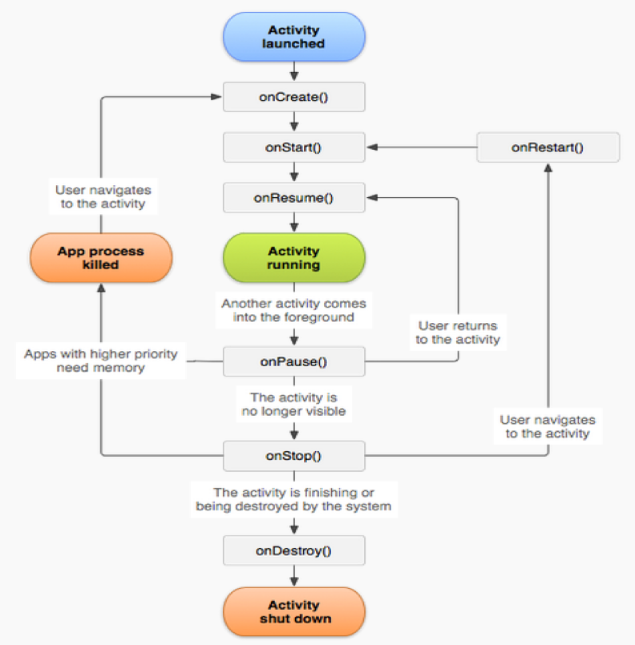
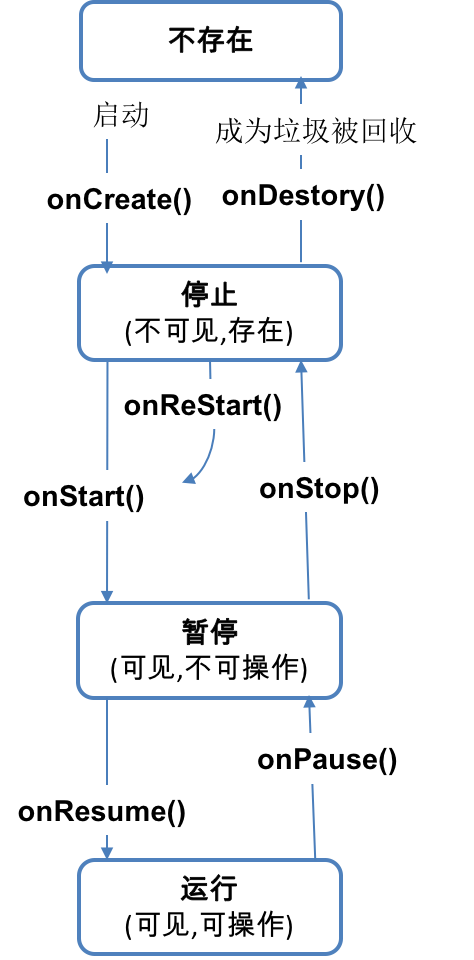
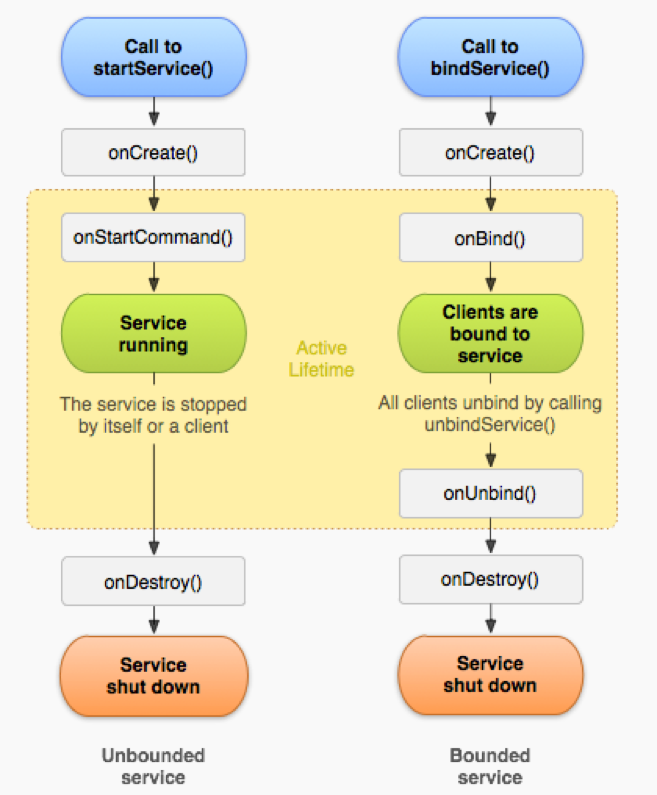
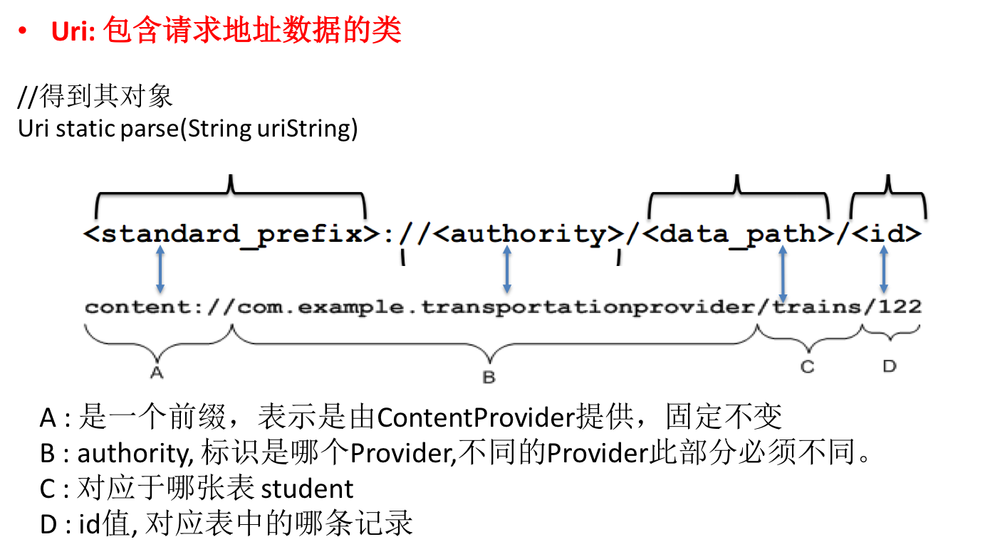
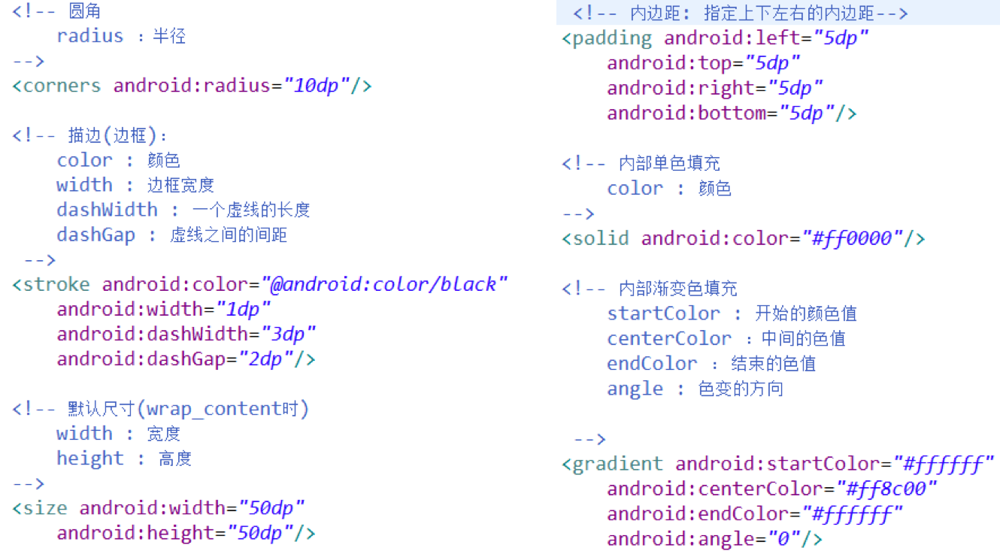
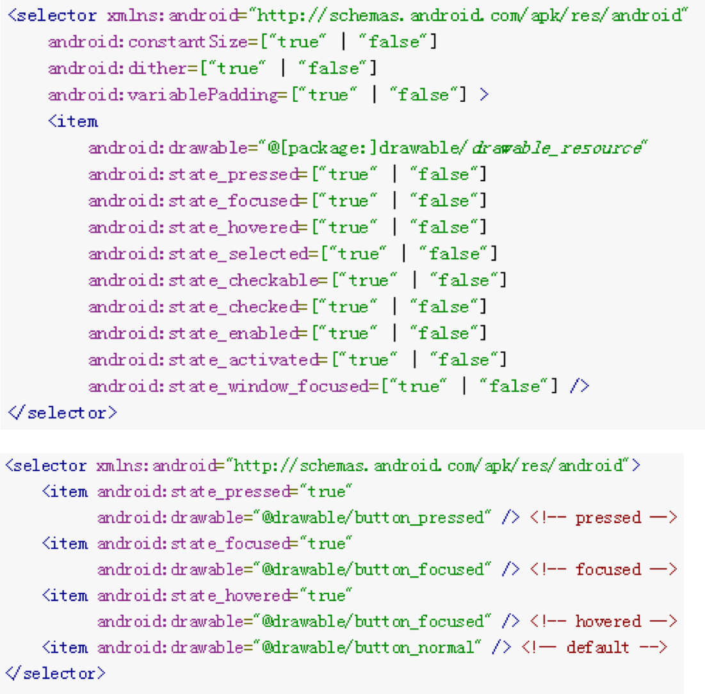
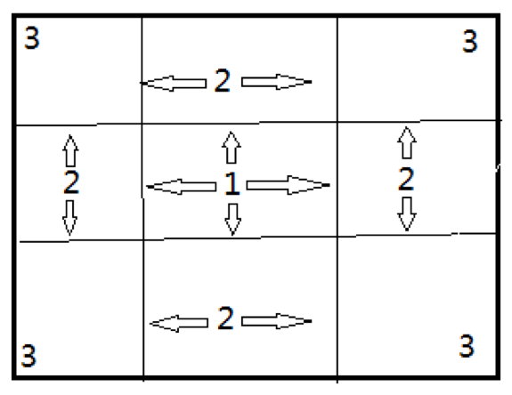

[TOC]

# 1.Android快速入门
## 1. 介绍Android
### 1.1Android相关基础知识
### 1.2Android系统架构
> DVM和JVM区别

- 首要差别 
    + Dalvik: 基于寄存器，编译和运行都会更快些 
    + JVM: 基于栈, 编译和运行都会慢些

- 字节码的区别 
    + Dalvik: 执行.dex格式的字节码，是对.class文件进行压缩后产生的,文件变小
    + JVM: 执行.class格式的字节码

- 运行环境的区别 　 　
    + Dalvik : 一个应用启动都运行一个单独的虚拟机运行在一个单独的进程中
    + JVM: 只能运行一个实例, 也就是所有应用都运行在同一个JVM中

### 2.完成第一个Android应用
### 2.1搭建开发环境
### 2.2开发第一个应用HelloAndroid
## 3.三个开发调试工具
### 3.1ADB
> adb是什么:Android 调试桥(Android Debug Bridge)是多种用途的调试工具帮助你管理设备或模拟器的状态

- adb常用命令
    + adb [help]                    -show this help message
    + devices                       -list all connected devices
    + adb shell                     -run remote shell interactively
    + adb push <local> <remote>     -copy file/dir to device
    + adb pull <remote> [<local>]   -copy file/dir from device
    + adb install –r apkPath           -push this package file to the device install
    + adb uninstall packageName  -remove this app package from the device
    + adb start-server              -ensure that there is a server running
    + adb kill-server               - kill the server if it is running
    + ctrl+c               -退出shell     close
    + cls                  -清空屏幕     clears


### 3.2DDMS
> DDMS是什么?-->全称是Dalvik Debug Monitor Service,Android 开发环境中的Dalvik虚拟机调试监控服务

- DDMS的四个重要的视窗
    + Logcat :　查看日志输出：
    + File Explorer：查看系统内部文件
    + Devices：显示关联的Android设备
    + Emulator Control：操作控制关联的Android设备


### 3.3Log

> 比较Log与System.out


- Log提供了多个级别的打印输出方法, 在LogCat窗口中显示的颜色不同
- Log打印时必须指定TAG, 在LogCat中可以通过添加TAG过滤查看
- LogCat中可以通过两种方式过滤:
    + TAG名: 显示所有此标签名的输出
    + 应用包名: 显示指定包名应用的所有输出


## 4.常见资源简介及API

- Activity: 四大应用组件之一
    + onCreate(): 自动调用的方法, 在其中加载布局显示
    + setContentView(int layoutId): 加载布局
    + View findViewById(int id): 根据id找到对应的视图对象
- R: 应用的资源类
    + R.drawable: 包含所有图片资源标识的内部类
    + R.layout: 包含所有布局资源标识的内部类
    + R.id: 包含所有视图id标识的内部类
    + R.string: 包含所有字符串标识的内部类
- View/Button: 视图/按钮
    + setonClickListener(listener): 给视图设置点击监听
    + View.OnClickListener : 内部接口
    + void onClick(View v) : 点击事件的回调方法

- Toast: 用来显示短时间提示文本的类
    + static Toast makeText(...) : 创建一个toast对象
    + show(): 显示小提示

## 5.手机尺寸相关

> 尺寸相关概念

- 手机的尺寸: 屏幕对角线的长度,单位为英寸(2.54cm)
- 手机的分辨率: 屏幕能显示的像素的数量, 一般用在长方向上数量*宽方向上数量来表达
- 手机的像素密度: pixels per inch，也称PPi，即每英寸屏幕能显示的像素数，像素密度越大，显示画面细节就越丰富。
> 计算:像素密度={1+√[(长度像素数-1)^2+(宽度像素数-1)^2]}/屏幕尺寸

- DPI: Dots Per Inch（每英寸所打印的点数或线数）的缩写，用来表示打印机打印分辨率, 但有时也会用dpi来代指ppi
- 手机的密度: Density, 以160ppi为基准, 即像素密度为160时Density为1
    + ldpi 120ppi 0.75
    + mdpi 160dpi 1.0
    + hdpi 240dpi 1.5
    + xhdpi 320dpi 2.0

>  尺寸单位

- px: pixels(像素) 
    + 1px就的长度就对应屏幕一个像素点的大小

- dp/dip: device-independent pixels(设备无关像素)
    + 1dp =  (dpi / 160)  px
    + 1dp =  density  px      160-1px    1200.75    320-2px
    + 1px = 1/density dp

- sp：scaled pixels(可缩放像素)
    + 与dp类似，但是可以根据用户的字体大小首选项进行缩放

注意: Android在运行时会自动将dp/dip/sp为单位的尺寸转换为像素单位的值

> 尺寸单位比较

- dp与px的比较?  
    + 以px为单位的长度, 在差手机上会变大, 在好手机上变小
    + 以dp为单位则不会变化

- dp与sp的比较?
    + 用户可以在系统设置中设置文本的大小
    + 如果字体大小使用sp为单位, 设置有效果
    + 如果字体大小使用dp为单位, 设置没有效果


- 在布局文件视图的宽高尽量用match_parent/wrap_content
- 如果必须指定特定值, 使用dp/dip做单位
- 文本大小使用sp做单位


## 6.关于颜色
> 在Android中字体颜色或背景颜色使用RGB来表达

- R : red 红色
- G : green 绿色
- B : blue 蓝色

> 每个色相用一个2位的十六进制的数来表达,颜色值的前面为带一个字符 : #

- 红色: #ff0000
- 绿色: #00ff00
- 白色: #ffffff
- 黑色: #000000
具体需要什么颜色可以查颜色表

# 2.Activity
## 1.理论概述
> Servlet的理解回顾

- 狭义:
    + Servlet是一个interface, 我们的Servlet类都必须是此接口的实现类

- 广义:
    + Servlet是一种服务器端的组件, 用来处理 客户端(浏览器)提交的请求, 并返回一个响应界面

> 组件特点

- 它的类必须实现特定接口或继承特定类
- 需要在配置文件中配置其全类名
- 它的对象不是通过new来创建的, 而是系统自动创建的
- 它的对象具有一定的生命周期, 它的类中有对应的生命周期回调方法

> Activity定义: Activity, 直译为活动, 它是Android定义的四大应用组件之一,也是最重要用得最多的.

- Activity用来提供一个能让用户操作并与之交互的界面
- 一个应用有多个界面, 也就是包含多个Activity
- 打电话,发短信, 拍照,发邮件等功能都是通过Activity来做的 

### 1.1Activity的理解
> Activity与Servlet

| 比较  |Servlet | Activity|
| ------------- | ------------- |----|
组件|服务器端组件|Android客户端组件
规范定义的接口或类|Servlet接口|Activity类
注册|web.xml|AndroidManifest.xml
生命周期方法 | ① init() ②service() {doGet(),doPost()} ③ destory() | ① onCreate() ②onStart() ③onResume() ④onPause()  ⑤onStop()  ⑥onRestart()  ⑦onDestroy()|


> Intent理解

- Intent, 直译为意图, 也就是你想要做什么或想要去哪?
- Intent是Activity, Service和BroadcastReceiver这三个应用组件之间进行通信的信使, 
例如: 我要在Activity中启动另一个Actvity, 就必须使用Intent对象
- 意图对象还可以携带数据
- 注意: Intent不是Android中的四大应用组件之一

> Intent的分类

- 显示意图 : 明确指定的目标组件的意图
    + 创建对象 : Intent(Context context, Class clazz)
    + 何时使用 : 当操作当前自己应用的组件时使用

- 隐式意图 : 没有明确指定目标组件的意图
    + 创建对象 : Intent(String action)
    + 何时使用 : 当操作其它应用的组件时使用


### 1.2Intent和IntentFilter的理解

- 在配置Activity时, 可以为Activity指定一个IntentFilter的配置
- 如果你的Activity希望其它应用能访问到, 需要配置<intent-filter>
- 如果你想启动其它应用的界面你必须用隐式intent, 且目标界面Activty配置了<intent-filter>
- 它的作用类似于web中的为Servlet配置的<url-pattern>

```xml
        <activity android:name=".MainActivity">
            <intent-filter>
                <action android:name="android.intent.action.MAIN" />

                <category android:name="android.intent.category.LAUNCHER" />
            </intent-filter>
        </activity>
```

### 1.3相关API

> Intent: 意图

- Intent(Context packageContext, Class<?> cls) :  用于创建显示意图对象
- Intent(String action): 用于创建隐式意图对象
- putExtra(String name, Xxx value): 保存额外数据
- Xxx getXxxExtra(String name): 获取额外数据
- setData(Uri data): 设置有特定格式的uri数据

> Activity: 活动
      
- startActivity(Intent intent): 一般启动Activity
- startActivityForResult(int reqCode, Intent intent): 带回调启动Activity
- onActivityResult(int reqCode, int resultCode, Intent data): 回调方法
- setResult(int resultCode, Intent data): 设置要返回的结果
- finish(): 结束当前Activity
- getIntent(): 得到启动Activity的意图

> Activity生命周期相关方法

- onCreate()
- onStart()
- onResume()
- onPause()
- onRestart()
- onStop()
- onDestory()

> View: 代表视图的根基类

- setOnClickListener(OnClickListener listener): 设置点击监听
- setOnLongClickListener(OnLongListener listener): 设置长按监听

> SmsManager: 发送短信的工具类

- static SmsManager getDefault() : 得到当前对象
- sendTextMessage(...): 发送短信

> 设置点击监听的2种方式     

- 方式一:  Activity中添加监听:  
    + view.setOnClickListener(OnClickListener listener);
    + view.setOnLongClickListener(OnLongClickListener listener)
- 方式二:  布局添加监听:  
    + layout中:   android:onclick=“方法名”
    + Activity中: public void 方法名(View v) {   }
- 方式三: implements View.OnClickListener {}


## 2.Activity开发 
### 2.1Activity的使用

> 启动:

- 一般启动
    + startActivity(Intent intent)

- 带回调的启动
    + startActivityForResult(int reqCode, Intent intent)
    + onActivityResult(int reqCode, int resultCode, Intent data)

> 携带数据: 

- 如何携带额外数据
    + intent.putExtra(name, value) 

- 如何获取携带的额外数据
    + Xxx intent.getXxxExtra(name)
- 如何得到启动的intent
    + Intent getIntent()

> 结束:

- 一般结束
    + finish()

- 带结果的结束
    + setResult(int resultCode, Intent data)
    + finish()


### 2.2Activity的生命周期
> Activity界面的四种状态

- 运行状态: 可见也可操作
- 暂停状态: 可见但不可操作
- 停止状态: 不可见，但对象存在
- 死亡状态: 对象不存在


> Activity的生命周期回调方法

- onCreate()
- onStart()
- onResume()
- onPause()
- onRestart()
- onStop()
- onDestory()

> 生命周期

 

> 可见状态

 

### 2.3Activity的TaskStack
> 在Android中，系统用Task Stack (Back Stack)结构来存储管理启动的Activity对象

- 一个应用启动,系统就会为其创建一个对应的Task Stack来存储并管理该应用的Activity对象
- 只有最上面的任务栈的栈顶的Activity才能显示在窗口中

### 2.4 Activity的launchMode
在Android中, 启动一个Activity有时需要总是创建一个新对象, 有时需要复用已有的对象, 可以通过在配置activity时通过launchMode属性指定

> launchMode属性值(4个)为:

- standard: 标准模式，每次调用startActivity()方法就会产生一个新的实例。
- singleTop: 如果已经有一个实例位于Activity栈的顶部时，就不产生新的实例；如果不位于栈顶，会产生一个新的实例。
- singleTask: 只有一个实例, 默认在当前Task中(若使用,弹出其上的所有activity)
- singleInstance: 只有一个实例, 创建时会新建一个栈, 且此栈中不能有其它对象


## 3. 功能练习
- 进入电话拨打界面的意图: Intent.ACTION_DIAL
- 进入短信编辑界面的意图: Intent.ACTION_SENDTO
- 拨打电话的意图: Intent.ACTION_CALL
- 发送短信的工具类: SmsManager
-  需要的权限:
    +  打电话的权限: android.permission.CALL_PHONE
    +  发短信的权限: android.permission.SEND_SMS
- 拨打电话的Uri: tel:110
- 进入短信界面的电话Uri : smsto:110
- 携带额外短信数据的标识名为: sms_body

# 3.UI

## 1.理论概述
### 1.1理解UI
> UI的定义: 全称user interface, 意为: 用户界面

- UI由View和ViewGroup组成        
- View类是所有视图(包括ViewGroup)的根基类
- View在屏幕上占据一片矩形区域, 并会在上面进行内容绘制
- ViewGroup包含一些View或ViewGroup, 用于控制子View的布局


### 1.2UI事件
> 理解UI事件

- 当用户通过手指触摸UI时, 系统会自动创建对应的Event对象
- Android中提供了多种方式拦截处理不同类型的事件
- 视图本身就可以处理发生在该视图上的事件

> 使用UI事件: 

- Android提供了很多不同类型的事件监听器接口
    + View.OnClickListener:  onClick() 
    + View.OnLongClickListener: onLongClick()
    + View.OnTouchListener: onTouch() 
    + View.OnCreateContextMenuListener: onCreateContextMenu()
    + View.OnFocusChangeListener:  onFocusChange()
    + View.OnKeyListener:  onKey()

- 给视图添加事件监听的方式
    + view.seton…Listener(listener)

## 2.UI开发
### 2.1常用UI组件 
> TextView :  文本视图

```xml
<TextView
    android:id=“@+id/tv_test1_message“     //指定id
    android:layout_width=“match_parent“  //宽度
    android:layout_height=“wrap_content“ //高度
    android:text=“这是TextView的内容“     // 文本
    android:textColor=“#ff0000“                    // 文本颜色
    android:textSize=“20sp” />                       // 字体大小

```

> EditText :  文本输入框

```xml
<EditText
        android:id="@+id/et_test1_number"
        android:layout_width="match_parent"
        android:layout_height="wrap_content"
        android:hint=“请输入手机号“                                //默认提示文本
        android:inputType=“phone”>    // 输入数据类型限定
</EditText>

```


> Button :  按钮

```xml
<Button
    android:id="@+id/btn_test1_submit"
    android:layout_width="match_parent"
    android:layout_height="wrap_content"
    android:text="提 交" />
```

> ImageView : 图片视图 

```xml
<ImageView
    android:id="@+id/iv_test1_play"
    android:layout_width="70dp"
    android:layout_height="70dp"
    android:background=“@drawable/ic_launcher“          //背景图片
    android:src=“@android:drawable/ic_media_play”/> //前景图片
```

- 设置前景图片
public void setImageResource(int resId)
- 设置背景图片
public void setBackgroundResource(int resid)


> CheckBox : 多选框 

```xml
<CheckBox
            android:id="@+id/cb_test1_basket"
            android:layout_width="wrap_content"
            android:layout_height="wrap_content"
            android:text="篮球" 
            android:checked=“true”/> //标识默认是否勾选
```

> 相关方法

```java
//判断当前是否勾选
boolean isChecked()
//设置CheckBox是否勾选
void setChecked(boolean checked)
//设置选中状态改变的监听
void setOnCheckedChangeListener(OnCheckedChangeListener listener)

```


>RadioGroup/RadioButton : 单选框 

```
<RadioGroup      
            android:id="@+id/rg_test1_sex"
            android:layout_width="fill_parent"
            android:layout_height="wrap_content"
            android:orientation="horizontal" >
            <RadioButton
                android:id="@+id/rb_test1_male"
                android:layout_width="wrap_content"
                android:layout_height="wrap_content"
                android:text="男" />
            <RadioButton
                android:id="@+id/rb_test1_female"
                android:layout_width="wrap_content"
                android:layout_height="wrap_content“
                android:checked="true"
                android:text="女" />
/RadioGroup>
```


> OptionMenu

- OptionMenu在点击手机的menu键触发

- Activity : onCreateOptionsMenu(Menu menu)
    + 显示OptionMenu的回调方法, 在此方法中向Menu中添加MenuItem

- 添加menuItem的两种方式:
    + 纯编码方式:   menu.add(….)
    + 加载menu文件的方式:
        * MenuInflater menuInflater = getMenuInflater();
        * menuInflater.inflate(R.menu.main_option, menu);
- Activity : onOptionsItemSelected(MenuItem item)
当选择某个菜单项的回调方法


> ContextMenu : 上下文菜单

- View : setOnCreateContextMenuListener(listener)
    + 为某个视图添加创建ContextMenu的监听(需要长按触发)

- Activity : onCreateContextMenu(menu, view, menuInfo)
    + 显示菜单的回调方法 

- Activity : onContextItemSelected(MenuItem item)
    + 当选择某个菜单项的回调方法


>Progressbar : 进度条

```xml
<ProgressBar                                                   //默认为圆形进度条
            android:id="@+id/pb_test3_loading1"
            android:layout_width="wrap_content"
            android:layout_height="wrap_content" />
```


```
<ProgressBar
        android:id="@+id/pb_test3_loading2"
        style=“?android:attr/progressBarStyleHorizontal“    //水平进度条
        android:layout_width="match_parent“
        android:layout_height="wrap_content"
        android:progress=“2“     //当前进度, 默认为0
        android:max=“10”/>      // 最大进度, 默认为100

```

> 相关设置

```java
ProgressBar
     void setProgress(int Progress) : 设置当前进度
     int getProgress() : 得到当前进度
     void setMax(int max) : 设置最大进度
     int getMax() : 设置或得到最大进度

View
     void setVisibility(int visibility) : 设置视图的可见性
     View. VISIBLE : 标识可见
     View. INVISIBLE : 标识不可见, 但占屏幕空间
     View.GONE : 标识不可见, 也不占屏幕空间

```


> SeekBar : 可手动滑动的进度条

```xml
<SeekBar
        android:id="@+id/sb_test3_prgress"
        android:layout_width="match_parent"
        android:layout_height="wrap_content" />
```

> 相关设置

```java
SeekBar:
         setOnSeekBarChangeListener(OnSeekBarChangeListener l)  : 设置改变的监听
OnSeekBarChangeListener:
         onProgressChanged(SeekBar seekBar, int progress, boolean fromUser) : 进度改变
         onStartTrackingTouch(SeekBar seekBar) : 按下滑杆
         onStopTrackingTouch(SeekBar seekBar) : 从滑杆离开

```


> AlertDialog : 警告框

```java
AlertDialog  :
     show()   : 显示警告框
     没有公开的构造方法, 只能通过其内部类Builder来创建
AlertDialog.Builder :   
     create() : 创建AlertDialog对象
     show() : 创建AlertDialog对象, 同时将其显示出来
     setTitle(CharSequence title) : 设置标题
     setMessage(CharSequence message) : 设置内容
     setPositiveButton(String text, OnClickListener listener) : 设置正面按钮
     setNegativeButton(String text, OnClickListener listener): 设置负面按钮
     dismiss() : 移除dialog
     setSingleChoiceItems(….)设置单选项列表

```

> 自定义AlertDialog

```
DialogBuilder  :
     setView(View view)  :  设置Dialog中的视图
View :
     View inflate(Context context, int resource, ViewGroup root)  : 动态加载布局得到View

```


> ProgressDialog : 带进度Dialog

```java
ProgressDialog  :
     static show(Context context, CharSequence title,CharSequence message)  : 显示dialog
     
     ProgressDialog(Context context) : 构造方法
     setProgressStyle(int style)  设置样式 
     ProgressDialog.STYLE_HORIZONTAL :水平进度条样式

```

> 启动分线程(复习)

- 方式一
```java
new Thread(){
       public void run(){
             //下面的代码在分线程执行
       }
}.start();

```

- 方式二
```java
new Thread(new Runnable(){
         public void run(){
             //下面的代码在分线程执行
       }
}).start();

```

> DateDialog : 日期Dialog

```java
 public DatePickerDialog(Context context,
            OnDateSetListener callBack,   //点击确定的回调监听
            int year,                                       //显示年份
            int monthOfYear,                      // 显示月分
            int dayOfMonth)                      // 显示日

```

> TimeDialog : 时间Dialog

```java
 public TimePickerDialog (Context context,
            OnTimeSetListener callBack,   //点击确定的回调监听
            int hourOfDay,                           //几点
            int minute,                                 // 几分
            boolean is24HourView)          // 是否是24小时制

```


### 2.2常用UI布局

- 布局本身是不能显示出任何数据, 它可以包含一些子视图, 并控制子视图的布局

- 常用的Layout
    + LinearLayout
    + RelativeLayout
    + FrameLayout
    + ListView(后面讲)
    + GridView(后面讲)
    + 其它

> LinearLayout:线性布局: 用来控制其子View以水平或垂直方式展开显示

- 重要属性: 
    + orientation(方向)
    + layout_weight(权重)
    + layout_weight

> RelativeLayout:相对布局: 用来控制其子View以相对定位的方式进行布局显示

- 相对布局相关属性:
    + 兄弟视图之间: 同方向对齐, 反方向对齐
    + 与父视图之间: 同方向对齐, 居中

> FrameLayout

- 帧布局中的每一个子View都代表一个画面，默认以屏幕左上角作为（ 0,0 ）坐标，按定义的先后顺序依次逐屏显示 ， 后面出现的会覆盖前面的画面, 
- 通过子View的android:layout_gravity 属性来指定子视图的位置


### 2.3常用视图标签属性
> 属性的划分

- 针对任何View的属性
    + 常用的最基本属性
    + 内边距属性 padding
    + 外边距属性 margin
- 只针对RelativeLayout的属性
    + 反方向对齐属性 to/above/below
    + 同方向对齐属性  align
    + 相对父视图的属性  alignparent/center
- 只针对LinearLayout的属性
    + 权重属性  weight
    + 方向属性 oritation

> 常用基本属性 

| 属性名 | 作用 |
| ------------- | ------------- |
id|为控件指定相应的ID  @+id/idname
layout_width |指定当前视图的宽度
layout_height|指定当前视图的宽度
text |指定控件当中显示的文字
textSize|指定控件当中字体的大小 
background|指定该控件所使用的背景(图片|颜色)
layout_gravity|控件本身相对于父视图的位置
grivity|指定控件中的内容的基本位置


> 内边距与外边距 


> 相对兄弟视图定位 

> 相对父视图定位 


### 2.4ListView
> ListView理解 

- ListView是一种用来显示多个可滑动项(Item)列表的的ViewGroup
- 需要使用Adapter将集合数据和每一个Item所对应的布局动态适配到ListView中显示
- 显示列表: listView.setAdapter(adapter)
- 更新列表: adapter.notifyDataSetChanged()


> Adapter

- ArrayAdapter:  显示最简单的列表(文本)
集合数据为List<String>或String[]

- SimpleAdapter: 显示复杂的列表
集合数据必须是List<Map<String,Object>>类型

- BaseAdapter: 显示复杂的列表
集合数据可以是任意类型的集合List<Xxx>

- SimpleCursorAdapter: 显示复杂的列表
集合数据是数据库查询结果集


### 2.5Style和theme
> 样式(Style)

- 理解: 
多个视图属性的集合, 在写布局时, 当多个视图有不少相同的属性时, 可以把这些相同的属性放在一起在styles.xml中定义成一个Style, 而在布局文件中使用@style/style_name统一引用
- 作用: 
    + 复用视图标签属性
- 目标: 
    + 针对的是窗口中的某些视图
- 系统样式:
    + Android也定义了些系统样式可以使用
    + 使用系统样式: @android:style/xxx

> 主题(theme)

- 理解: 
    + 主题的本质也是style
    + 在styles.xml中定义, 在manifest.xml中引用
- 作用: 
    + 复用视图标签属性
- 目标: 
    + 针对整个应用或某个Activity的界面
- 系统常用主题:
    + @android:style/Theme.Light.NoTitleBar : 没有标题 
    + @android:style/Theme.Light.NoTitleBar.Fullscreen: 全屏
    + @android:style/Theme.Dialog : 对话框


## 3.应用练习
> 显示所有应用列表


# 4.Android数据存储
> 数据存储方式

- ① SharedPrefrence
- ② 手机内部文件存储
- ③ 手机外部文件存储
- ④ Sqlite数据库存储
- ⑤ 远程服务器(网络上传)


## 1.SharedPrefrence
> SP存储专门用来存储一些单一的小数据

- 存储数据的类型:  boolean, float, int, long, String
- 数据保存的路径:  /data/data/packageName/shared_prefs/yyy.xml
- 可以设置数据只能是当前应用读取, 而别的应用不可以
- 应用卸载时会删除此数据


> 使用

```java
        SharedPreferences spfile = getSharedPreferences("spfile", Context.MODE_PRIVATE);
        SharedPreferences.Editor editor = spfile.edit();

        String value = "chenxzong";
        editor.putString("name",value);
```


> SharedPreferences: 对应sp文件的接口

- context.getSharedPreferences (String name, int mode): 得到SP对象
    + name: 文件名(不带.xml)
    + mode: 生成的文件模式(是否是私有的,即其它应用是否可以访问)
- 从sp取数据
    + sp.getXxx(name,defaultValue): 根据name得到对应的数据

> Editor : 能更新sp文件的接口

- Editor sp.edit() : 得到Editor对象
    + editor.put(name, value) : 保存一个键值对, 没有真正保存到文件中
    + editor.remove(name)
    + editor.commit(): 提交, 数据真正保存到文件中了

## 2.手机内部文件存储
> 说明:应用运行需要的一些较大的数据或图片可以用文件保存的手机内部

- 文件类型: 任意
- 数据保存的路径: /data/data/projectPackage/files/
- 可以设置数据只能是当前应用读取, 而别的应用不可以
- 应用卸载时会删除此数据


> 相关API

- 读取文件
    + FileInputStream fis = openFileInput("logo.png");
- 保存文件
    + FileOutputStream fos = openFileOutput("logo.png", MODE_PRIVATE)
- 得到files文件夹对象
    + File filesDir = getFilesDir();  
- 操作asserts下的文件
    + 得到AssetManager : context.getAssets();
- 读取文件: 
    + InputStream open(filename);
- 加载图片文件
    + Bitmap BitmapFactory.decodeFile(String pathName)   // .bmp/.png/.jpg


## 3.手机外部文件存储(sd)

> 说明: 应用运行用到的数据文件(如图片)可以保存到sd卡中

- 文件类型: 任意
- 数据保存的路径: 
    + 路径1:其它应用可以访问,应用卸载时删除 
        * /storage/sdcard/Android/data/packageName/files/
    + 路径2:其它应用可以访问, 应用卸载时不会删除 
        * /storage/sdcard/xxx/
必须保证sd卡挂载在手机上才能读写, 否则不能操作


> 相关API

- Environment :  操作SD卡的工具类
    + 得到SD卡的状态：Environment.getExternalStorageState() 
    + 得到SD卡的路径：Environment.getExternalStorageDirectory()
    + SD卡可读写的挂载状态值：Environment.MEDIA_MOUNTED

- context. getExternalFilesDir():  
    + 得到/mnt/sdcard/Android/data/pageckage_name/files/xxx.txt

- 操作SD卡的权限:android.permission.WRITE_EXTERNAL_STORAGE


## 4.Sqlite数据库存储

> 说明:应用运行需要保存一系列有一定结构的数据, 比如说公司员工信息

- 文件类型: .db
- 数据保存的路径: /data/data/projectPackage/databases/xxx.db
- 默认情况下其它应用不能访问, 当前应用可以通过ContentProvider提供其它应用操作
- 应用卸载时会删除此数据

SQLite (http://www.sqlite.org/)，是一款轻型的关系型数据库服务器, 移动设备的数据库存储都使用SQLite, 
>它的特点: 

- 安装文件小: 最小只有几百K, Android系统已经安装
- 支持多操作系统: Android, WP, IOS, Windows, Linux等
- 支持多语言: 比如 Java 、 PHP、C#等. 
- 处理速度快:  处理速度比Mysql, Oracle, SqlServer都要快(数据量不是特别大)
- Sqlite中的一个数据库就是一个.db文件(本质上.db的后缀都可以不指定)


> sqlite 命令

| 命令 | 功能 |
| ------------- | ------------- |
adb shell  | 进入系统根目录
cd data/data/…/databases | 进入包含数据库文件的文件夹下
sqlite3 contacts2.db |使用sqlite3命令连接指定的数据库文件, 进入连接模式
.help | 查看命令列表
.tables | 查看所有表的列表
.exit | 退出数据库连接模式
.schem | 查看创建表的语句
.quit | 退出sqlite3
insert/delete/update/select| 增删改查语句

> 数据类型

- Sqlite支持的数据类型与Mysql相似, 常用的数据类型
- INT/INTEGER : 整数
- FLOAT/DOUBLE : 小数
- CHAR/VARCHAR/TEXT : 字符串文本
- BLOB : 文件
- DATE/ DATETIME : 日期/日期时间


> sqlite建表:  

Sqlite操作数据库的sql语句基本与mysql一样,  但需要注意下面2个点:
最大的不同在于创建表时可以不用指定字段类型, Sqlite可以适时的自动转换, 但除varchar类型外最好指定类型
Sqlite中的主键最名称建议使用_id

```sql
create table employee (
       _id integer primary key autoincrement, /*主键,自增长*/
       name varchar,                /*字符串*/
       salary double,                                /*小数*/
       birthday date                                /*日期, 可直接插入日期格式字符串*/
)

```


create table employee (
       _id integer primary key autoincrement,
       name varchar,
       salary double,
       birthday date
)


> sql语句CRUD

```sql
/*插入*/
INSERT INTO employee (name,salary,birthday) VALUES('Tom', 8000, '1988-09-21');
/*删除*/
DELETE FROM employee WHERE _id=2 
/*更新*/
UPDATE employee SET name='Jack',salary=salary+1000 WHERE _id=1
/*查找*/
SELECT * FROM employee where _id=3

```

> 相关API

- SQLiteOpenHelper: 数据库操作的抽象帮助类
    
SQLiteOpenHelper(Context context, String name, 
CursorFactory factory, int version) : 构造方法, 指定数据库文件名和版本号
abstract void onCreate(SQLiteDatabase db) : 用于创建表
abstract void onUpgrade() : 用于版本更新
SqliteDatabase getReadableDatabase() : 得到数据库连接

> SqliteDatabase: 代表与数据库的连接的类
   
- long insert(): 用于执行insert SQL, 返回id值
- int update(): 用于执行update SQL
- int delete(): 用于执行delete SQL
- void execSql(sql) : 执行sql语句
- beginTransaction(): 开启事务
- setTransactionSuccessful(): 设置事务是成功的
- endTransaction(): 结束事务, 可能提交事务或回滚事务
- openDatabase(String path, CursorFactory factory, int flags):  得到数据库连接

> Cursor query(): 用于执行select SQL, 返回包含查询结果数据的Cursor

Cursor : 包含所有查询结果记录的结果集对象(光标,游标)
    
- int getCount() : 匹配的总记录数
- boolean moveToNext() : 将游标移动到下一条记录的前面
- Xxx getXxx(columnIndex) : 根据字段下标得到对应值
- int getColumnIndex(columnname): 根据字段名得到对应的下标
    

     


> 自定义SQLiteOpenHelper

```java
public class EmployeeDbHelper extends SQLiteOpenHelper {
    private Context mContext;
    public static final String TABLE_NAME="employee";
    public static final String DB_NAME="atguigu.db";
    //定义表的字段方便访问
    public static String Employee_name ="name";
    public static String Employee_salary ="salary";
    public static String Employee_birthday ="birthday";
    private static final String CRETE_TABLE = "create table employee (\n" +
            "       _id integer primary key autoincrement,\n" +
            "       name varchar,\n" +
            "       salary double,\n" +
            "       birthday date\n" +
            ")";
    public EmployeeDbHelper(Context context, String name, SQLiteDatabase.CursorFactory factory, int version) {
        super(context, name, factory, version);
        mContext = context;
    }
    @Override
    public void onCreate(SQLiteDatabase sqLiteDatabase) {
        sqLiteDatabase.execSQL(CRETE_TABLE);
        Toast.makeText(mContext, "创建数据库", Toast.LENGTH_SHORT).show();
    }
    @Override
    public void onUpgrade(SQLiteDatabase sqLiteDatabase, int i, int i1) {
    }
    public void insertEmployee(Employee employee){
    }
}
```


> 主调页面

```java
public class SqliteActivity extends AppCompatActivity implements View.OnClickListener {
    private EmployeeDbHelper dbHelper;
    private Context mConext;
    @Override
    protected void onCreate(Bundle savedInstanceState) {
        super.onCreate(savedInstanceState);
        setContentView(R.layout.activity_sqlite);
        mConext = this;
        findViews();
    }
    /**
     * 穿件数据库
     */
    private void createSqliteDB() {
        dbHelper = new EmployeeDbHelper(mConext, EmployeeDbHelper.DB_NAME, null, 1);
        dbHelper.getReadableDatabase();
    }
    private Button btCreateDb;
    private Button btInsert;
    private Button btDelete;
    private Button btUpdate;
    private Button btQuery;
    private TextView tvInfo;
    private EditText etId;
    /**
     * Find the Views in the layout<br />
     * <br />
     * Auto-created on 2017-09-18 01:07:19 by Android Layout Finder
     * (http://www.buzzingandroid.com/tools/android-layout-finder)
     */
    private void findViews() {
        btCreateDb = (Button) findViewById(R.id.bt_create_db);
        btInsert = (Button) findViewById(R.id.bt_insert);
        btDelete = (Button) findViewById(R.id.bt_delete);
        btUpdate = (Button) findViewById(R.id.bt_update);
        btQuery = (Button) findViewById(R.id.bt_query);
        tvInfo = (TextView) findViewById(R.id.tv_info);
        etId = (EditText) findViewById(R.id.et_employee_id);
        btCreateDb.setOnClickListener(this);
        btInsert.setOnClickListener(this);
        btDelete.setOnClickListener(this);
        btUpdate.setOnClickListener(this);
        btQuery.setOnClickListener(this);
    }
    /**
     * Handle button click events<br />
     * <br />
     * Auto-created on 2017-09-18 01:07:19 by Android Layout Finder
     * (http://www.buzzingandroid.com/tools/android-layout-finder)
     */
    @Override
    public void onClick(View v) {
        if (v == btCreateDb) {
            //创建数据库
            createSqliteDB();
        } else if (v == btInsert) {
            // 插入数据
            insertToDb();
        } else if (v == btDelete) {
            deleteFromDb();
        } else if (v == btUpdate) {
            updateDate();
        } else if (v == btQuery) {
            query();
        }
    }
    //查询
    private void query() {
        SQLiteDatabase db;
        if (dbHelper != null) {
            db = dbHelper.getReadableDatabase();
        } else {
            createSqliteDB();
            db = dbHelper.getReadableDatabase();
        }
        Cursor cursor = db.query(EmployeeDbHelper.TABLE_NAME,null,null,null,null,null,null);
        StringBuilder builder = new StringBuilder();
        while (cursor.moveToNext()){
            String name = cursor.getString(cursor.getColumnIndex(EmployeeDbHelper.Employee_name));
            double salary = cursor.getDouble(cursor.getColumnIndex(EmployeeDbHelper.Employee_salary));
            String birthday = cursor.getString(cursor.getColumnIndex(EmployeeDbHelper.Employee_birthday));
            Employee employee = new Employee(name,salary,new Date());
            builder.append(employee.toString()+"\n");
        }
        tvInfo.setText(builder.toString());
    }

    //更新
    private void updateDate() {
        SQLiteDatabase db;
        if (dbHelper != null) {
            db = dbHelper.getReadableDatabase();
        } else {
            createSqliteDB();
            db = dbHelper.getReadableDatabase();
        }
        String name = "chenxzong";
        Employee employee = new Employee("chenxzong", 9000.99, new Date());
        String id = etId.getText().toString().trim();
       // String sql = String.format("update %s set name = '%s',salary= %s where _id = %s", EmployeeDbHelper.TABLE_NAME, employee.getName(), employee.getSalary(), id);
        //db.execSQL(sql);
        ContentValues values = new ContentValues();
        values.put(EmployeeDbHelper.Employee_name,employee.getName());
        values.put(EmployeeDbHelper.Employee_salary,employee.getSalary());
        int update = db.update(EmployeeDbHelper.TABLE_NAME, values, "_id=?", new String[]{id});
        Toast.makeText(mConext, "更新id=" + id+":"+update, Toast.LENGTH_SHORT).show();
    }
    //删除
    private void deleteFromDb() {
        SQLiteDatabase db;
        if (dbHelper != null) {
            db = dbHelper.getReadableDatabase();
        } else {
            createSqliteDB();
            db = dbHelper.getReadableDatabase();
        }
        String id = etId.getText().toString().trim();
//        db.delete(EmployeeDbHelper.TABLE_NAME,"_id=?",new String[]{id});
//        String deleteSql = "delete from "+ EmployeeDbHelper.TABLE_NAME+" where _id = "+id;
        String sql = String.format("delete from %s where _id = %s", EmployeeDbHelper.TABLE_NAME, id);
        db.execSQL(sql);
        Toast.makeText(mConext, "删除id=" + id, Toast.LENGTH_SHORT).show();
    }
    /**
     * 插入数据到db
     */
    private void insertToDb() {
        Toast.makeText(mConext, "插入数据", Toast.LENGTH_SHORT).show();
        SQLiteDatabase db = dbHelper.getReadableDatabase();
//        db.execSQL();
        Employee employee = new Employee("aaa", 12.32, new Date());
        ContentValues values = new ContentValues();
        values.put(EmployeeDbHelper.Employee_name, employee.getName());
        values.put(EmployeeDbHelper.Employee_salary, employee.getSalary());
        values.put(EmployeeDbHelper.Employee_birthday, String.valueOf(employee.getBirthday()));
        db.insert(EmployeeDbHelper.TABLE_NAME, null, values);
        tvInfo.setText(employee.toString());
    }
}
```


## 5.远程服务器存储
> 说明:

对于联网的APP来说, 可能需要通过请求向服务器提交请求数据, 也可能需要从服务器端获取数据显示
如何编码实现客户端与服务器端的交互呢? 
- JDK内置的原生API
    + HttpUrlConnection
- Android内置的包装API
    + HttpClient    浏览器  
- 异步网络请求框架
    + Volley
    + Xutils
> 注意:

- 访问网络, 需要声明权限: android.permission.INTERNET
- 访问网络的程序必须在分线程执行 


### 1.HTTP协议

>一次HTTP请求的过程   

- 建立连接-发送请求->处理请求->返回数据->发送请求2->………关闭连接

- HTTP请求的常用方式
    + GET
    + POST
- HTTP请求的格式
    + 请求行
    + 请求头
    + 请求体
- HTTP响应的格式
    + 响应行
    + 响应头
    + 响应体


### 2.HttpUrlConnection
> 使用HttpurlConnection,其中HttpClient由于APIS数量过多,扩展困难,等缺点,在Android6.0中完全移除

- URL : 包含请求地址的类
    + URL(path) : 包含请求路径的构造方法
    + openConnection() : 得到连接对象

- HttpURLConnection : 代表与服务器连接的类
    + setMethod(“GET/POST”) : 设置请求方式
    + setConnectTimeout(time) : 设置连接超时时间, 单位为ms
    + setReadTimeout(time): 设置读取服务器返回数据的时间
    + connect() : 连接服务器
    + int getResponseCode(): 得到服务器返回的结果码
    + Int getContentLength() : 得到服务器返回数据的长度(字节)
    + getOutputStream() : 返回一个指向服务器端的数据输出流
    + getInputStream() : 返回一个从服务器端返回的数据输入流
    + disconnect() : 断开连接


### 3.第三方Volley
### 4.Okhttp

# 5.消息机制与异步任务
## 1.理论概述
- 在Android中,只有在UIThread中才能直接更新界面
- 在Android中,长时间的工作(联网)都需要在workerThread中执行
- 在分线程获得服务器数据后, 需要立即到主线程去更新界面显示数据

> 如何实现线程间通信呢?

- 消息机制
- 异步任务

## 2.消息机制

### 2.1相关API
- Message :消息   
    + 可理解为线程间通讯的数据单元, 可通过message携带需要的数据
    + 创建对象:  Message.obtain(what)
    + 封装数据
        * public int what    //id 标识
        * public int arg1
        * public int arg2
        * public Object obj

- Handler : 处理器
    + Handler是Message的处理器，同时也负责消息的发送和移除的工作
    + 发送即时消息:  sendMessage(Message msg)
    + 发送延时消息:  sendMessageDelayed(Message msg, long time)
    + 处理消息: handleMessage(Message msg)    (回调方法)
    + 移除还未处理的消息: removeMessages(int what)


- MessageQueue : 消息队列
    + 用来存放通过Handler发送的消息
    + 它是一个按Message的when排序的优先级队列

- Looper(钩子) : 循环器
    + 负责循环取出Message Queue里面的当前需要处理的Message
    + 交给对应的Handler进行处理
    + 处理完后, 将Message缓存到消息池中, 以备复用


### 2.2测试用例
### 2.3应用小DEMO
### 2.4消息机制原理


## 3. 异步任务
> 什么是异步任务?

- 逻辑上: 以多线程的方式完成的功能需求
- API上: 指AsyncTask类

- AsyncTask的理解
    + 在没有AsyncTask之前, 我们用Handler+Thread就可以实现异步任务的功能需求
    + AsyncTask是对Handler和Thread的封装, 使用它更编码更简洁,更高效
    + AsyncTask封装了ThreadPool, 比直接使用Thread效率要高

### 3.1相关API

- AsyncTask: 简化Handler处理多线程通信的问题
- AsyncTask<Params, Progress, Result>
    + Params 启动任务执行的输入参数，比如HTTP请求的URL。
    + Progress 后台任务执行的百分比。
    + Result 后台执行任务最终返回的结果，比如String。
- execute(Params... params) :启动任务, 开始任务的执行流程

- void onPreExecute() :在分线程工作开始之前在UIThread中执行，一般用来显示提示视图
- Result doInBackground(Params... params) :在workerThread中执行, 完成任务的主要工作，通常需要较长的时间
- void onPostExecute(Result result) :在doInBackground()执行完后在UIThread中执行,一般用来更新界面 
- publishProgress(Progress... values) : 在分线程中, 发布当前进度
- void onProgressUpdate(Progress... values) : 在主线程中更新进度

### 3.2测试用例
### 3.异步任务过程

## 4.应用练习


# 6.Service
## 1.理论概述
> Service是什么?

1. Service是一个应用组件, 它用来在后台完成一个时间跨度比较大的工作且没有关联任何界面
2. 一个Service可以完成下面这些工作:
    访问网络 
    播放音乐
    文件IO操作
    大数据量的数据库操作
    ……
3. 服务的特点:
- Service在后台运行，不用与用户进行交互         
- 即使应用退出, 服务也不会停止. 
- 在默认情况下，Service运行在应用程序进程的主线程(UI线程)中，如果需要在Service中处理一些网络连接等耗时的操作，那么应该将这些任务放在分线程中处理，避免阻塞用户界面


> 区别Service与Activity?


1. Activity:    
- Activity对应一个界面
- 应用退出, Activity对象就会死亡
- 应用再次进入, 启动的Activity对象是重新创建的

2. Service
- 不与任何界面关联
- 应用退出, Service仍在运行
- 应用再次进入, 启动的Service还是前面运行的Service对象


> 区别Service与Thread?

1. Service
- 用来在后台完成一个时间跨度比较大的工作的应用组件
- Service的生命周期方法运行在主线程, 如果Service想做持续时间比较长的工作, 需要启动一个分线程(Thread)
- 应用退出: Service不会停止
- 应用再次进入: 可以与正在运行的Service进行通信

2. Thread

- 用来开启一个分线程的类, 做一个长时间的工作
- Thread对象的run()在分线程执行
- 应用退出: Thread不会停止, 
- 应用再次进入: 不能再控制前面启动的Thread对象

> Service的分类

1. Local Service(本地服务)
Service对象与Serive的启动者在同个进程中运行, 两者的通信是进程内通信

2. Remote Service(远程服务)
Service对象与Service的启动者不在同一个进程中运行, 这时存在一个进程间通信的问题, Android专门为此设计了AIDL来实现进程间通信


## 2.本地Service
### 2.1使用本地Service
> 定义Service

```java
//定义一个类继承于Service类
public class MyService extends Service {

}
```

```xml
//在AndroidManifest.xml中配置Service
<service android:name=".test.MyService">
<intent-filter>
    <action android:name="com.atguigu.service.test.MyService" />
</intent-filter>
</service>

```

> 启动与停止Service


```java
方式一 :  一般启动与停止
context.startService(Intent intent)
context.stopService(Intent intent)

方式二 : 绑定启动与解绑
context.bindService(Intent intent, ServiceConnection connection)
context.unbindService(ServiceConnection connection)

区别: 看Service启动后是否与启动者有关联?
     Service对象经历的生命周期是否相同?

```


### 2.2Service的生命周期
> 生命周期方法:

- onCreate()
- onStartCommand()
- onBind()
- onUnbind()
- onDestroy()

 


## 3.远程Service
> AIDL理解

每个应用程序都运行在自己的独立进程中，并且可以启动另一个应用进程的服务，而且经常需要在不同的进程间传递数据对象。
在Android平台，一个进程不能直接访问另一个进程的内存空间，所以要想对话，需要将对象分解成操作系统可以理解的基本单元，并且有序的通过进程边界。

> AIDL (Android Interface Definition Language) 

- 用于生成可以在Android设备上两个进程之间进行进程间通信(interprocess communication, IPC)的代码。
- 如果在一个进程中（例如Activity）要调用另一个进程中（例如Service）对象的操作，就可以使用AIDL生成可序列化的参数。

> 定义AIDL接口

创建文件：IStudentService.aidl

```java
package com.atguigu.service.test.remote;
import com.atguigu.service.test.remote.Student;
interface IStudentService {
       Student getStudentById(int id);
}   
```

>定义自定义类型Student

```java
//必须实现Parcelable接口
public class Student implements Parcelable {
  private int id;
  private String name;

  public int describeContents() { return 0;}
  //将当前对象的属性数据写到Parcel包对象中(也就是打包) 
 public void writeToParcel(Parcel dest, int flags) {
    dest.writeInt(this.id);
    dest.writeString(this.name);
  }
  // 添加一个静态成员,名为CREATOR,该对象实现了Parcelable.Creator接口
  public static final Parcelable.Creator<Student> CREATOR = new Parcelable.Creator<Student>() {
    public Student createFromParcel(Parcel source) {
     return new Student(source.readInt(), source.readString());
    }
    public Student[] newArray(int size) {
     return new Student[size];
    }
  };
}   

```

### 3.1理解
### 3.2使用远程Service
## 3.使用AIDL(AndroidInterfaceDefinitionLanguage)开启服务
1. 创建aidl文件(main/aidl/)
> com/tianwen/chen/serviceaidl/IServicePlayer.aidl


```
package com.tianwen.chen.serviceaidl;
// Declare any non-default types here with import statements
interface IServicePlayer {
 
 
          void paly();//播放
          void pause();//暂停
          void stop();//停止
          int getDuration();//时长
          int getCurrentPosition();//当前位置
          void seekTo(int position);//拖动位置
          boolean setLoop(boolean loop);//是否循环
 
 
 
 }
```

2. 创建service


```
package com.tianwen.chen.serviceaidl.service;
import android.app.Service;
import android.content.Intent;
import android.media.MediaPlayer;
import android.os.IBinder;
import android.os.RemoteException;
import com.tianwen.chen.serviceaidl.IServicePlayer;
import java.io.IOException;
import static com.tianwen.chen.serviceaidl.R.raw.music;
public class MusicService extends Service {
    private MediaPlayer mediaPlayer;//声明一个音乐播放器
    public MusicService() {
    }
    @Override
    public IBinder onBind(Intent intent) {
        // TODO: Return the communication channel to the service.
        //throw new UnsupportedOperationException("Not yet implemented");
        return  this.stub;//用于bindService方式调用
    }
    @Override
    public void onCreate() {
        super.onCreate();
        this.mediaPlayer = MediaPlayer.create(this, music);
    }
    //stub用于实现aidl中的方法
    IServicePlayer.Stub stub = new IServicePlayer.Stub(){
        @Override
        public void paly() throws RemoteException {
            mediaPlayer.start();
        }
        @Override
        public void pause() throws RemoteException {
            mediaPlayer.pause();
        }
        @Override
        public void stop() throws RemoteException {
            mediaPlayer.stop();
            try {
                mediaPlayer.prepare();
            } catch (IOException e) {
                e.printStackTrace();
            }
        }
        @Override
        public int getDuration() throws RemoteException {
            return mediaPlayer.getDuration();
        }
        @Override
        public int getCurrentPosition() throws RemoteException {
            return mediaPlayer.getCurrentPosition();
        }
        @Override
        public void seekTo(int position) throws RemoteException {
            mediaPlayer.seekTo(position);
        }
        @Override
        public boolean setLoop(boolean loop) throws RemoteException {
            return loop;//设置循环
        }
    };
}

```


3. MainActivity中

- 初始化视图,设置监听


```

    private Button btPlay;
    private Button btPause;
    private Button btStop;
    private SeekBar sbMusicProgress;//进度条
    /**
     * Find the Views in the layout<br />
     * <br />
     * Auto-created on 2017-09-11 15:07:21 by Android Layout Finder
     * (http://www.buzzingandroid.com/tools/android-layout-finder)
     */
    private void findViews() {
        btPlay = (Button) findViewById(R.id.bt_play);
        btPause = (Button) findViewById(R.id.bt_pause);
        btStop = (Button) findViewById(R.id.bt_stop);
        sbMusicProgress = (SeekBar) findViewById(R.id.sb_music_progress);
        btPlay.setOnClickListener(this);
        btPause.setOnClickListener(this);
        btStop.setOnClickListener(this);
        //seekbar拖动监听
        sbMusicProgress.setOnSeekBarChangeListener(new SeekBar.OnSeekBarChangeListener() {
            @Override
            public void onProgressChanged(SeekBar seekBar, int i, boolean b) {
            }
            @Override
            public void onStartTrackingTouch(SeekBar seekBar) {
            }
            @Override
            public void onStopTrackingTouch(SeekBar seekBar) {//设置跳转到拖动位置
                if(iServicePlayer!=null) {
                    int progress = seekBar.getProgress();
                    try {
                        iServicePlayer.seekTo(progress);
                    } catch (RemoteException e) {
                        e.printStackTrace();
                    }
                }
            }
        });
    }
```


- 创建ServiceConnection

```
    IServicePlayer iServicePlayer;
    private ServiceConnection connection = new ServiceConnection() {
        @Override
        public void onServiceConnected(ComponentName componentName, IBinder iBinder) {
            iServicePlayer = IServicePlayer.Stub.asInterface(iBinder);//
        }

        @Override
        public void onServiceDisconnected(ComponentName componentName) {

        }
    };

```


- 绑定service


```
    /**
     * 绑定服务
     */
    private void initService() {
        Intent service = new Intent(this, MusicService.class);
        bindService(service, connection, Service.BIND_AUTO_CREATE);
        startService(service);

    }
```


- 通过点击事件开启aidl中接口方法


```
 @Override
    public void onClick(View v) {
        if (v == btPlay) {
            Toast.makeText(this, "play", Toast.LENGTH_SHORT).show();
            try {
                iServicePlayer.paly();//播放
                //更新界面
                handler.sendEmptyMessageDelayed(UPDATE_PROGRESS,100);
            } catch (RemoteException e) {
                e.printStackTrace();
            }
        } else if (v == btPause) {
            Toast.makeText(this, "pause", Toast.LENGTH_SHORT).show();
            try {
                iServicePlayer.pause();
                handler.removeMessages(UPDATE_PROGRESS);
            } catch (RemoteException e) {
                e.printStackTrace();
            }
        } else if (v == btStop) {
            Toast.makeText(this, "stop", Toast.LENGTH_SHORT).show();
            try {
                iServicePlayer.stop();
                handler.removeMessages(UPDATE_PROGRESS);
                sbMusicProgress.setProgress(0);//进度归0
            } catch (RemoteException e) {
                e.printStackTrace();
            }
        }
    }
```


- handler更新进度


```
    private Handler handler = new Handler() {
        @Override
        public void handleMessage(Message msg) {
            switch (msg.what) {
                case UPDATE_PROGRESS:
                    int duration = 0;
                    try {
                        duration = iServicePlayer.getDuration();
                        int current = iServicePlayer.getCurrentPosition();
                        sbMusicProgress.setMax(duration);
                        sbMusicProgress.setProgress(current);
                    } catch (RemoteException e) {
                        e.printStackTrace();
                    }
                    handler.removeMessages(UPDATE_PROGRESS);
                    handler.sendEmptyMessageDelayed(UPDATE_PROGRESS,100);
                    break;
            }
        }
    };
```


- seekbar拖动监听

```
  //seekbar拖动监听
        sbMusicProgress.setOnSeekBarChangeListener(new SeekBar.OnSeekBarChangeListener() {
            @Override
            public void onProgressChanged(SeekBar seekBar, int i, boolean b) {

            }

            @Override
            public void onStartTrackingTouch(SeekBar seekBar) {

            }

            @Override
            public void onStopTrackingTouch(SeekBar seekBar) {//设置跳转到拖动位置
                if(iServicePlayer!=null) {
                    int progress = seekBar.getProgress();
                    try {
                        iServicePlayer.seekTo(progress);

                    } catch (RemoteException e) {
                        e.printStackTrace();
                    }
                }

            }
        });
```


## 4.应用练习


### 4.1使用本地Service播放音乐
### 4.2使用远程Service挂断通话
### 4.3实现黑名单电话的自动拦截


> TelephonyManager: 电话服务的管理器
       context.getSystemService(Context.TELEPHONY_SERVICE)
    : 得到它的对象
       listen(phoneStateListener,PhoneStateListener.LISTEN_CALL_STATE)
    :监听电话状态: 

PhoneStateListener : 电话状态监听器
      onCallStateChanged(int state, String incomingNumber)
    : 电话状态改变的回调方法
      TelephonyManager.CALL_STATE_IDLE : 空闲状态
      TelephonyManager.CALL_STATE_RINGING : 响铃状态
      TelephonyManager.CALL_STATE_OFFHOOK : 接通状态


# 8.广播
## 1.理论概述

> 理解广播与广播接收器

- 广播事件处理属于 **系统级** 的事件处理(一般事件处理是属于View级的事件处理)
- 一个应用可以在发生特定事件时发送Broadcast, 系统中任何应用只要注册了对应Receiver就会接收到此Broadcast
- 一个应用如果对某个广播感兴趣, 就可以注册对应的Receiver来接收广播
- 广播事件机制是应用程序(进程间)之间通信的一种手段

> 相关API

- Context
    + sendBroadcast(Intent intent) : 发送一般广播
    + sendOrderedBroadcast(Intent intent) : 发送有序广播
    + registerReceiver(receiver, intentFilter) : 注册广播接收器
    + unRegisterReceiver(receiver) : 解注册广播接收器

- BroadcastReceiver
    + onReceive(Context context, Intent intent) : 接收到广播的回调
    + abortBroadcast() : 中断广播的继续传播
    + boolean isOrderedBroadcast() : 判断是否是有序广播


> 常见系统广播

- 收到短信广播 : android.provider.Telephony.SMS_RECEIVED
- 开机完成广播 : Intent.ACTION_BOOT_COMPLETED
- 应用被卸载广播 : Intent.ACTION_PACKAGE_REMOVED
- 手机锁屏 : Intent.ACTION_SCREEN_OFF
- 手机开屏 : Intent.ACTION_SCREEN_ON


## 2.使用广播

> 编写广播接收器类 

```java
public class MyBroadcastReceiver extends BroadcastReceiver{
     public void onReceive(Context context, Intent intent){
        //处理广播
    }
}

```

> 注册广播接收器 

- 方式一: 配置文件注册(静态注册)

```xml
       <receiver android:name="com.atguigu.t6_br.MyBroadcastReceiver">
            <!--priority指定当前receiver的优先级, 值是0-1000, 越大越好  -->
            <intent-filter android:priority="500">
                <action android:name="com.atguigu.t6_br.mybroadcastreceiver"/>
            </intent-filter>
        </receiver>
```


- 方式二: 硬编码注册(动态注册)
```java
MyBroadcastReceiver2 receiver2 = new MyBroadcastReceiver2();
IntentFilter filter = new IntentFilter(action);
registerReceiver(receiver2, filter);

```


> 静态注册和动态注册区别

| 区别 | 静态注册 | 动态注册|
| ------------- | ------------- |----|
注册方式 |配置文件 |Java代码
注册的时间|应用安装成功/手机开机完成 注册时不会创建对象,接收到广播才创建 |执行registerReceiver(receiver, intentFilter),注册就创建对象| 
生命结束的时间(解注册) | 应用卸载,对象执行onReceive()后就回收了 | 执行unregisterReceiver()(activity退出必须解注册)解注册后对象被回收 | 
应用情景 | 需要监听的时间为应用的整个生命过程中 | 只服务于某个Activity/Service


> 发送广播->发送两种类型的广播 

- 发送一般广播:context.sendBroadCast(Intent intent)
- 发送有序广播: context.sendOrderedBroadcast(Intent intent)


## 3.广播使用(第一行代码)

### 1.简介
> Android中广播主要分为两种类类型:①标准广播 ②有序广播


① 标准广播(NormalBroadCast):
>一种完全异步执行的广播,在广播发出后,所有广播接收器几乎同时接收到这条广播信息没有先后顺序可言;效率比较高,无法拦截
+ 无先后顺序
+ 效率高
+ 无法拦截

> 工作流程

```
graph LR
A[发出一条广播]-->B[广播接收器1]
A-->C[广播接收器2]
A-->D[广播接收器3]
```

② 有序广播(OrderbroadCast)
> 是一种同步执行的广播,在广播发出后,同一时刻只有一个广播接收器能接收到这条广播消息,当这个广播接收器的逻辑执行完毕后,才会继续传递.

- 广播接收器是有先后顺序的
- 优先级高的广播接收器可以先收到广播
- 前面的广播接收器可以截断正则传递的广播

> 有序广播工作流程图

```
graph LR
A[发出一条广播]-->B[广播接收器1]
B-->|可截断|C[广播接收器2]
C-->D[广播接收器3]
```


### 2.接收系统广播
> Android内置很多级别的广播,可以在应用程序中通过监听广播获得各种系统信息.

- 开机完成
- 电量变化
- 时间或时区改变


#### 2.1 动态注册监听网络变化
> 步骤:

1. 创建广播接收器
2. 注册广播
3. 解注册(动态注册的广播需要取消注册)

```
public class MainActivity extends AppCompatActivity {

    private IntentFilter intentFilter;
    private NetChangReceiver netChangReceiver;

    @Override
    protected void onCreate(Bundle savedInstanceState) {
        super.onCreate(savedInstanceState);
        setContentView(R.layout.activity_main);

        intentFilter = new IntentFilter();//过滤器
        intentFilter.addAction("android.net.conn.CONNECTIVITY_CHANGE");

        netChangReceiver = new NetChangReceiver();//创建自定义广播
        registerReceiver(netChangReceiver,intentFilter);


    }


    @Override
    protected void onDestroy() {
        super.onDestroy();
        unregisterReceiver(netChangReceiver);
    }

    /**
     * 自定义网络变化广播接收器
     */
    class  NetChangReceiver extends BroadcastReceiver{

        @Override
        public void onReceive(Context context, Intent intent) {
            Toast.makeText(context, "网络发生变化", Toast.LENGTH_SHORT).show();


            //显示网络状态
            ConnectivityManager manager = (ConnectivityManager) getSystemService(Context.CONNECTIVITY_SERVICE);//系统服务类

            NetworkInfo activeNetworkInfo = manager.getActiveNetworkInfo();//获取网络状态

            if(activeNetworkInfo!=null && activeNetworkInfo.isAvailable()) {
                tv.setText("网络可用");
            }else {
                tv.setText("网络不可用");
            }

        }
    }

```

> 添加权限

```

<uses-permission android:name="android.permission.ACCESS_NETWORK_STATE" />
```


#### 2.2 静态注册实现开机启动

> 动态广播可以自由的控制注册于注销,在灵活性方面有很大优势,但是也存在一个缺点,必须在程序启动后才能接受广播,因为注册的逻辑是写在onCreate中的.

- 使用静态注册,可以是应用未启动的情况下就可以接收到广播

> 步骤:

1. 创建广播接收器
2. 功能清单中静态注册广播
3. onReceiver中实现接收到广播后的逻辑


> 接收开机完成的广播的接收器

```

/**
 * 开机自动启动广播
 */
public class AutoStartReceiver extends BroadcastReceiver {

    @Override
    public void onReceive(Context context, Intent intent) {
        // TODO: This method is called when the BroadcastReceiver is receiving
        // an Intent broadcast.
//        throw new UnsupportedOperationException("Not yet implemented");
        Toast.makeText(context, "开机完成", Toast.LENGTH_LONG).show();


        //开机完成,启动主界面
        Intent mainIntent = new Intent(context,MainActivity.class);
        mainIntent.setFlags(FLAG_ACTIVITY_NEW_TASK);

        context.startActivity(mainIntent);

    }


}

```
> 添加权限

```
    <uses-permission android:name="android.permission.RECEIVE_BOOT_COMPLETED"/>

```


> 静态注册


```
 <receiver
            android:name=".AutoStartReceiver"
            android:enabled="true"
            android:exported="true">
            <intent-filter >
                <action android:name="android.intent.action.BOOT_COMPLETED"></action>
            </intent-filter>
        </receiver>
```


### 3.发送自定义广播

#### 3.1发送标准广播

1. 需要先定义一个自定义广播接收器

```
public class MyBroadCastReceiver extends BroadcastReceiver {
    @Override
    public void onReceive(Context context, Intent intent) {
        Toast.makeText(context, "接收到自定义广播", Toast.LENGTH_SHORT).show();
    }
}

```

2. 注册自定义广播:指定action

```
        <receiver android:name=".brodcast_receiver.MyBroadCastReceiver">
            <intent-filter>
                <action android:name="com.example.MY_BROADCAST"/>
            </intent-filter>
        </receiver>
```

3. button按钮发送广播


```
        Button button = (Button) findViewById(R.id.button);

        button.setOnClickListener(new View.OnClickListener() {
            @Override
            public void onClick(View view) {
                Intent intent = new Intent("com.example.MY_BROADCAST");//可以携带信息(通过Intent)
                sendBroadcast(intent);
            }
        });
        
```


#### 3.2 发送有序广播
> 广播是一种可以跨进程的通信方式.可以在应用程序中发出广播,其它应用程序应该也可以收到.

1.创建有序广播接收器(并实现截断功能)
2. 注册有序广播接收器,并制定优先级
3. 发送有序广播


> 1. 创建有序广播接收器(并实现截断功能)

```
/**
 * Created by chen on 2017/9/15.
 * 有序广播接收器: 可以截断
 */

public class MyOrderBroadCastReceiver extends BroadcastReceiver {
    @Override
    public void onReceive(Context context, Intent intent) {
        Toast.makeText(context, "MyOrderBroadCastReceiver:接收到有序广播,并截断", Toast.LENGTH_SHORT).show();
        abortBroadcast();
    }
}

```


> 2. 注册有序广播接收器,并制定优先级

```
        <receiver
            android:enabled="true"
            android:exported="true"
            android:name=".brodcast_receiver.MyOrderBroadCastReceiver">
            <intent-filter android:priority="100">
                <action android:name="com.example.MY_BROADCAST"/>
            </intent-filter>
        </receiver>
```


> 3. 发送有序广播

```
      Button button = (Button) findViewById(R.id.button);

        button.setOnClickListener(new View.OnClickListener() {
            @Override
            public void onClick(View view) {
                Intent intent = new Intent("com.example.MY_BROADCAST");
                //sendBroadcast(intent);

                //发送有序广播
                sendOrderedBroadcast(intent,null);//null : 与权限相关的字符串
            }
        });
```


### 4.使用本地广播
> 前面的广播都是系统全局广播,发送的广播可以被其它任何程序接收到,并且也可以接收其它应用程序的广播.很容易引起安全性问题.

- 本地广播机制:
    - 发出广播只能在应用程序内部进行传递
    - 广播接收器只能接收来自本应用的广播
    

- 使用:使用LocalBoradcastManager对广播进行管理.并提供了
    - 发送广播的方法
    - 注册广播接收器的方法

> 使用LocalBroadcastManager 管理广播的注册和注销


1. 创建本地广播接收器

```

/**
 * 本地广播接收器
 */
public class LocalBroadCastReceiver extends BroadcastReceiver {

    @Override
    public void onReceive(Context context, Intent intent) {

        Toast.makeText(context, "接收本地广播", Toast.LENGTH_SHORT).show();
    }
}

```


2. onCreate动态注册本地广播


```
    private LocalBroadcastManager localBroadcastManager;
    private LocalBroadCastReceiver localReceiver;

    
    @Override
    protected void onCreate(Bundle savedInstanceState) {
        super.onCreate(savedInstanceState);

        ......
        //动态注册本地广播
        intentFilter  = new IntentFilter();

        intentFilter.addAction("com.example.LOCAL_BROADCAST");
        localReceiver = new LocalBroadCastReceiver();
        localBroadcastManager.registerReceiver(localReceiver,intentFilter);

        ......
        
    }
```


3. button发送本地广播

```
 Button button2 = (Button) findViewById(R.id.button2);
        button2.setOnClickListener(new View.OnClickListener() {
            @Override
            public void onClick(View view) {
                Intent intent = new Intent("com.example.LOCAL_BROADCAST");
                localBroadcastManager.sendBroadcast(intent);//发送本地广播
            }
        });
```

4. onDestroy()解注册广播


```
@Override
    protected void onDestroy() {
        super.onDestroy();

        //解注册本地广播
        localBroadcastManager.unregisterReceiver(localReceiver);
    }
```


# 9.ContentProvider

## 1.理论概述
> 为什么要有ContentProvider?

- 功能需求: 一个应用需要访问另一个应用的数据库表数据
- 实际情况: 一个应用的数据库文件是应用私有的, 其它应用不能直接访问


> ContentProvider是什么?

- ContentProvider是四大应用组件之一
- 当前应用使用ContentProvider将数据库表数据操作暴露给其它应用访问
- 其它应用需要使用ContentResolver来调用ContentProvider的方法
- 它们之间的调用是通过Uri来进行交流的

> 相关API

- ContentProvider  : 内容提供者类
```
//provider对象创建后调用(应用安装成功或手机启动完成)
public abstract boolean onCreate();
//查询表数据
Cursor query(Uri uri, String[] projection,String selection, String[] selectionArgs)
//插入表数据
Uri insert(Uri uri, ContentValues values);
//删除表数据
int delete(Uri uri, String selection, String[] selectionArgs)
//更新表数据
update(Uri uri, ContentValues values, String selection,String[] selectionArgs);

```


-  ContentResolver:  内容提供者的解析类
```
//得到它的对象
context.getContentResolver() 
//调用provider进行数据库CRUD操作
Insert()、delete()、update()、query()
//注册uri的监听
registerContentObserver(Uri uri, boolean notify,ContentObserver observer)
//解注册uri的监听
unregisterContentObserver(ContentObserver observer)
//通知监听器
notifyChange(Uri uri, ContentObserver observer)
```

- Uri数据类型

 

- UriMatcher : 用于匹配Uri的容器

```
//添加一个合法的URI
void addURI(String authority, String path, int code) 
//匹配指定的uri, 返回匹配码
int match(Uri uri) 
```

- ContentUris : 解析uri的工具类

```
//解析uri, 得到其中的id
long parseId(Uri contentUri) 
//添加id到指定的uri中
Uri withAppendedId(Uri contentUri, long id) 
```

## 2.ContentProvider开发

### 2.1  编写ContentProvider 

> 编写ContentProvider子类

```
class StudentContentProvider extends ContentProvider {
    //实现inert、delete、update和query等方法
}
```

> 在manifest.xml中注册

```xml
<provider
         android:name=".StudentContentProvider"
         android:authorities="com.atguigu.provider.studentprovider" 
    android:exported="true"/>
```

### 2.2.使用contentProvicer
- 得到其对象
context.getContentResolver()

- 使用其对象
```
inert()、delete()、update()和query()
    系统自动找到匹配的ContentProvider对象来操作数据

registerContentObserver(Uri uri, boolean notify,ContentObserver observer)
    注册uri的监听

unregisterContentObserver(ContentObserver observer)
    解注册uri的监听

notifyChange(Uri uri, ContentObserver observer)
    通知监听器

```


## 3.应用练习
> 选择手机联系人号

- 相关常量
    + 联系人URI: Phone. CONTENT_URI
    + 姓名字段: Phone.DISPLAY_NAME
    + 号码字段: Phone. NUMBER

- 读取联系人权限:
    + android.permission.READ_CONTACTS


# 10.Animation
## 1.理论概述

> 什么是动画? 

- 动画有下面两种情况
    + 同一个图形通过视图在界面上进行透明度,缩放,旋转,平移的变化(View动画)
    + 在界面的同一个位置上不断切换显示不同的图片(Drawable动画)

- 动画的分类
    + View Animation
    + Drawable Animation

- Android中提供了两种实现动画的方式
    + 纯编码的方式
    + Xml配置的方式
动画在应用中是非常常见的界面效果, 也是提高用户体验的一种好手段


> Animation的公用功能

- setDuration(long durationMillis) : 设置持续时间(单位ms)
- setStartOffset(long startOffset) : 设置开始的延迟的时间(单位ms)
- setFillBefore(boolean fillBefore) : 设置最终是否固定在起始状态
- setFillAfter(boolean fillAfter) : 设置最终是否固定在最后的状态
- setAnimationListener(AnimationListener listener) : 设置动画监听

- 坐标类型:
    + Animation.ABSOLUTE   
    + Animation.RELATIVE_TO_SELF    
    + Animation.RELATIVE_TO_PARENT

- 启动动画 : view.startAnimation(animation);
- 结束动画: view.clearAnimation()

- 动画监听器 : AnimationListener
    + onAnimationStart(Animation animation) : 动画开始的回调
    + onAnimationEnd(Animation animation) : 动画结束的回调
    + onAnimationRepeat(Animation animation) : 动画重复执行


> 缩放动画(Code ScaleAnimation)
 
- fromX : 开始时X轴上的缩放比例   
- toX : 结束时X轴上的缩放比例   
- fromY :开始时Y轴上的缩放比例
- toY :结束时Y轴上的缩放比例
- pivotXType : X轴坐标的类型(计算x轴上的偏移量的方式)
- pivotXVlaue : 中心点在X轴相对视图左顶点在x轴上的偏移量
- pivotYType :  Y轴坐标的类型(计算x轴上的偏移量的方式)
- pivotYValue : 中心点相对视图左顶点在y轴上的偏移量


> 缩放动画(Xml ScaleAnimation)

```
<scale xmlns:android="http://schemas.android.com/apk/res/android"
    android:duration="2000"
    android:fromXScale="0.0"
    android:fromYScale="0.0"
    android:pivotX=“1"
    android:pivotY=“0.5“           
    android:toXScale="1.0"
    android:toYScale="1.0"
    android:fillAfter="true"/>

```
- Animation.ABSOLUTE : 
    数值(默认以px为单位)   100
- Animation.RELATIVE_TO_SELF : 
    百分数,如:50% (以当前视图的宽度或高度其为基数来计算)   
- Animation.RELATIVE_TO_PARENT : 
    百分数+p,如:50%p (以父视图的宽度或高度其为基数来计算)


> 旋转动画(RotateAnimation)

- fromDegrees : 开始时的角度
- toDegrees : 结束时的角度
- pivotXType : X轴坐标的类型
- pivotXVlaue : X轴坐标的值
- pivotYType :  Y轴坐标的类型
- pivotYValue : Y轴坐标的值

```
<rotate xmlns:android="http://schemas.android.com/apk/res/android"
    android:duration="5000"
    android:fromDegrees="+90“
    android:toDegrees="-90"
    android:pivotX="0%"
    android:pivotY="0%"/>

```

> 透明度动画(AlphaAnimation)

- fromAlpha :　开始时的缩放比例
- toAlpha : 结束时的缩放比例

```
<alpha xmlns:android="http://schemas.android.com/apk/res/android"
android:interpolator="@android:anim/accelerate_interpolator"
android:fromAlpha="1.0"
android:toAlpha="0.0"
android:startOffset="500"
android:duration="1000" />

```

> 平移动画(TranslateAnimation)

- fromXType : 坐标类型
- fromXValue : 开始时X轴的坐标
- toXType :坐标类型
- toXValue : 结束时X轴的坐标
- fromYType :坐标类型
- fromYValue : 开始时Y轴的坐标
- toYType :坐标类型
- toYValue : 结束时Y轴的坐标

```
<translate xmlns:android="http://schemas.android.com/apk/res/android"
    android:duration="2000"
    android:fromXDelta="-100%p"
    android:fromYDelta="0%"
    android:toXDelta="0%"
    android:toYDelta="0%" />

```


> 复合动画(Code AnimationSet)

- 复合动画对象
    + AnimationSet animationSet = new AnimationSet(false);
-  添加一个单一动画
    +  animationSet.addAnimation(alpha);
    +  animationSet.addAnimation(rotate);
- 开启动画
    + iv_animation.startAnimation(animationSet);

> 复合动画(Xml AnimationSet)

```
<set xmlns:android="http://schemas.android.com/apk/res/android">
    <alpha
        android:duration="2000"
        android:fromAlpha="0.0"
        android:toAlpha="1.0" />
    <rotate
        android:duration="1000"
        android:fromDegrees="0"
        android:pivotX="50%"
        android:pivotY="50%“
        android:toDegrees="360" />
</set>
```

> Interpolator属性的使用:Interpolator 被用来修饰动画效果，定义动画的变化率，可以使存在的动画效果accelerated(加速)，decelerated(减速),repeated(重复)等。

- @android:anim/linear_interpolator  : 线性变化
- @android:anim/accelerate_interpolator  : 加速变化
- @android:anim/decelerate_interpolator  : 减速变化
- @android:anim/cycle_interpolator : 周期循环变化


> 动画监听: 在程序中可以对动画的特定时刻进行监听

- Animation.setAnimationListener(AnimationListener listener) : 设置动画监听


- 动画监听器 : AnimationListener
    + onAnimationStart(Animation animation) : 动画开始的回调
    + onAnimationEnd(Animation animation) : 动画结束的回调
    + onAnimationRepeat(Animation animation) : 动画重复执行


## 2.动画开发    
### 2.1使用View动画(补间动画)

- 单一动画(Animation)
    + 缩放动画(ScaleAnimation)
    + 透明度动画(AlphaAnimation)
    + 旋转动画(RotateAnimation)
    + 平移动画(TranslateAnimation)
- 复合动画(AnimationSet):由多个单一动画组合在一起的动画


#### 1.缩放动画(ScaleAnimation)
> 使用code设置动画

```java
    /**
     * 步骤:
     * 1. 创建动画对象
     * 2. 设置
     * 3. 启动动画
     */
    private void scaleCode() {
        Toast.makeText(this, "Code缩放", Toast.LENGTH_SHORT).show();
        String info = "宽度从0.5->1.5 高度:0.0->1.0 缩放圆心:顶部中心点(width/2,0) 延迟1s,持续2s,最终还原";
        //1.
//        ScaleAnimation scaleAnimation = new ScaleAnimation(0.5f,1.5f,0.0f,1.0f, Animation.ABSOLUTE,ivAtguigu.getWidth()/2,Animation.ABSOLUTE,0);
        ScaleAnimation scaleAnimation = new ScaleAnimation(0.5f, 1.5f, 0.0f, 1.0f, Animation.RELATIVE_TO_SELF, 0.5f, Animation.RELATIVE_TO_SELF, 0);
        //2.
        scaleAnimation.setStartOffset(1000);
        scaleAnimation.setDuration(2000);
        scaleAnimation.setFillBefore(true);//最终还原
        //3.
        ivAtguigu.startAnimation(scaleAnimation);
        tv_info.setText(info);
    }
```


> 使用XML设置动画

1. 设置动画文件xml 

```xml
<!-- res/anim -->
<?xml version="1.0" encoding="utf-8"?>
<set xmlns:android="http://schemas.android.com/apk/res/android">
    <scale
        android:fromXScale="0"
        android:fromYScale="0"
        android:toXScale="1.5"
        android:toYScale="1"
        android:pivotX="50%"
        android:pivotY="0"
        android:startOffset="1000"
        android:duration="3000"
        android:fillAfter="true"
        />
</set>
```


2. 代码中加载动画文件

```
    /**
     * 使用xml设置缩放
     * 1. 定义动画文件xml
     * 2. 加载动画文件
     * 3. 启动动画
     */
    private void scaleXml() {

        Toast.makeText(this, "XML缩放", Toast.LENGTH_SHORT).show();
        Animation animation = AnimationUtils.loadAnimation(this, R.anim.scale_img);
        ivAtguigu.startAnimation(animation);
    }
```

#### 2.透明度动画(AlphaAnimation)
> code:

```java
    private void alphaCode() {
        Toast.makeText(this, "Code透明", Toast.LENGTH_SHORT).show();
        //1.
        AlphaAnimation alphaAnimation = new AlphaAnimation(0, 1);
        //2
        alphaAnimation.setDuration(3000);
        ivAtguigu.startAnimation(alphaAnimation);
    }
```

> xml实现

```xml
<?xml version="1.0" encoding="utf-8"?>
<set xmlns:android="http://schemas.android.com/apk/res/android">
    <alpha android:fromAlpha="0"
        android:toAlpha="1"
        android:duration= "3000"

        />
</set>
```

> 代码加载

```java
    /**
     * 使用xml设置缩放
     * 1. 定义动画文件xml
     * 2. 加载动画文件
     * 3. 启动动画
     */
    private void alphaXml() {
        Toast.makeText(this, "xml透明", Toast.LENGTH_SHORT).show();
        Animation animation = AnimationUtils.loadAnimation(this, R.anim.alpha_img);
        ivAtguigu.startAnimation(animation);
    }

```


#### 3.旋转动画(RotateAnimation)
> code

```java
    /**
     * 步骤:
     * 1. 创建动画对象
     * 2. 设置
     * 3. 启动动画
     */
    private void rotCode() {
        Toast.makeText(this, "Code旋转", Toast.LENGTH_SHORT).show();
        RotateAnimation animation = new RotateAnimation(0, 90, Animation.ABSOLUTE, ivAtguigu.getWidth() / 2, Animation.ABSOLUTE, 0);
        animation.setDuration(1000);
        animation.setFillBefore(true);
        ivAtguigu.startAnimation(animation);
        //设置监听
        setanimationListener(animation);
    }
```

>xml实现

1. xml动画文件

```xml
<!-- res/anim -->
<?xml version="1.0" encoding="utf-8"?>
<set xmlns:android="http://schemas.android.com/apk/res/android">
    <rotate android:fromDegrees="0"
        android:toDegrees="90"
        android:pivotX="50%"
        android:pivotY="0"
        android:duration= "3000"

        />
</set>
```

2. 代码加载
```java
    /**
     * 使用xml设置
     * 1. 定义动画文件xml
     * 2. 加载动画文件
     * 3. 启动动画
     */
    private void rotXml() {
        Toast.makeText(this, "xml旋转", Toast.LENGTH_SHORT).show();

        Animation animation = AnimationUtils.loadAnimation(this, R.anim.rot_img);
        animation.setFillBefore(true);
        ivAtguigu.startAnimation(animation);

    }
```


#### 4.平移动画(TranslateAnimation)

> code

```java
    private void transCode() {

        Toast.makeText(this, "Code平移", Toast.LENGTH_SHORT).show();


        TranslateAnimation animation = new TranslateAnimation(Animation.ABSOLUTE, 0, Animation.ABSOLUTE, ivAtguigu.getWidth(), Animation.ABSOLUTE, 0, Animation.ABSOLUTE, ivAtguigu.getHeight());

        animation.setDuration(1000);
        animation.setFillAfter(false);
        ivAtguigu.startAnimation(animation);
    }
```

>xml实现

```xml
<?xml version="1.0" encoding="utf-8"?>
<set xmlns:android="http://schemas.android.com/apk/res/android">
    <translate
        android:fromXDelta="0"
        android:fromYDelta="0"
        android:toXDelta="0%"
        android:toYDelta="100%"
        android:duration="3000"
        />
</set>
```


```java

    /**
     * 使用xml设置缩放
     * 1. 定义动画文件xml
     * 2. 加载动画文件
     * 3. 启动动画
     */
    private void transXml() {
        Toast.makeText(this, "XML平移", Toast.LENGTH_SHORT).show();


        Animation animation = AnimationUtils.loadAnimation(this, R.anim.trans_img);

        ivAtguigu.startAnimation(animation);

    }
```


#### 5.复合动画

> code: 

```java
    
    /**
     * 复合动画
     * 1. 透明
     * 2. 旋转
     */
    private void setAnimCode() {

        //1. 透明
        AlphaAnimation alpha = new AlphaAnimation(0, 1);
        alpha.setDuration(1000);


        //2. 旋转
        RotateAnimation rotate = new RotateAnimation(0, 360, Animation.ABSOLUTE, ivAtguigu.getWidth() / 2, Animation.ABSOLUTE, ivAtguigu.getHeight() / 2);
        rotate.setDuration(3000);

//        rotate.setStartOffset(1000);//先后执行

        AnimationSet set = new AnimationSet(true);

        set.addAnimation(alpha);
        set.addAnimation(rotate);

        ivAtguigu.startAnimation(set);

    }
```


> xml实现

1.布局文件
```xml
<?xml version="1.0" encoding="utf-8"?>
<set xmlns:android="http://schemas.android.com/apk/res/android">
    <scale
        android:fromXScale="0"
        android:fromYScale="0"
        android:toXScale="1.5"
        android:toYScale="1"
        android:pivotX="50%"
        android:pivotY="0"
        android:startOffset="1000"
        android:duration="3000"

        android:fillAfter="true"
        />

    <rotate android:fromDegrees="0"
        android:toDegrees="360"
        android:pivotX="50%"
        android:pivotY="0"
        android:startOffset="3000"

        android:duration= "3000"

        />
</set>
```


2. 加载布局文件


```xml

    /**
     * 复合动画
     */
    private void setAnimXml() {
        Animation animation = AnimationUtils.loadAnimation(this, R.anim.set_anim_img);

        ivAtguigu.startAnimation(animation);

    }
```


#### 6.动画监听

```java
        animation.setAnimationListener(new Animation.AnimationListener() {
            @Override
            public void onAnimationStart(Animation animation) {
            }
            @Override
            public void onAnimationEnd(Animation animation) {
                Toast.makeText(AnimatoinMainActivity.this, "count:" + count, Toast.LENGTH_SHORT).show();
            }
            @Override
            public void onAnimationRepeat(Animation animation) {
            }
        });
```

#### 7.动画传感器(Interpolator)
> 可以改变动画速度


```java

        RotateAnimation rotate = new RotateAnimation(0, 360, Animation.ABSOLUTE, ivAtguigu.getWidth() / 2, Animation.ABSOLUTE, ivAtguigu.getHeight() / 2);
        rotate.setDuration(3000);
        rotate.setInterpolator(new LinearInterpolator());//匀速执行
//        rotate.setStartOffset(1000);//先后执行
        rotate.setRepeatCount(Animation.INFINITE);
        setanimationListener(rotate);
        ivAtguigu.startAnimation(rotate);
```


### 2.2使用Drawable动画(逐帧动画)

> 动画配置

```xml
<animation-list 
xmlns:android="http://schemas.android.com/apk/res/android"
android:oneshot="false">
<item android:drawable="@drawable/nv1" android:duration="500" />
<item android:drawable="@drawable/nv2" android:duration="500" />
<item android:drawable="@drawable/nv3" android:duration="500" />
<item android:drawable="@drawable/nv4" android:duration="500" />
</animation-list>

```

> imageview

```
<ImageView
    android:id="@+id/iv_dv"
    android:layout_width=“80dp"
    android:layout_height=“80dp"
    android:layout_marginTop="160dp"
    android:background="@drawable/anim_da" />

```

> 启动

```
//得到背景动画图上
AnimationDrawable ad = null;
ad = (AnimationDrawable) imageView.getBackground();
//启动动画
ad.start();
//停止动画
ad.stop();
```


> 定义动画文件 oneshot: 只重复一次

```xml
<!-- drawable/drawable_animation_run.xml -->
<?xml version="1.0" encoding="utf-8"?>
<animation-list
    android:oneshot="false"
    xmlns:android="http://schemas.android.com/apk/res/android">
    <item android:drawable="@drawable/nv1" android:duration="500"/>
    <item android:drawable="@drawable/nv2" android:duration="500"/>
    <item android:drawable="@drawable/nv3" android:duration="500"/>
    <item android:drawable="@drawable/nv4" android:duration="500"/>

</animation-list>
```


> imageview 设置动画背景 **background**

```xml
        <ImageView
            android:id="@+id/iv_running"
            android:background="@drawable/drawable_animation_run"
            android:layout_width="match_parent"
            android:layout_height="match_parent" />
```

> 3.代码中启动动画(切换停止/启动)

```java
    private boolean isRunning = false;
    private void drawableAnim() {
        AnimationDrawable background = (AnimationDrawable) iv_running.getBackground();
        if (isRunning) {
            background.stop();
            isRunning = false;
        } else {
            background.start();//启动
            background = null;
            isRunning = true;
        }
    }
```


##3.应用练习
3.1常用动画练习
3.2杀毒扫描效果

# 11.图形处理
## 1.理论概述
> 什么Graphics?

- 手机上显示的任何界面, 无论是文字,按钮或图片, 都是系统内置的一些API绘制的Graphics(图形,图像)
- Graphics分为2D和3D两种, 我们这里不去管3D Graphics
- 在我们应用中操作最多的Graphics就是图片, 如何操作图片是我们要学习的重点
- 如何利用系统的相关API绘制一个自定义的Graphics也是我们将要去


> 相关API

- Bitmap: 位图，图片在内存中数据对象  
    + .bmp 
    + .jpg 
    + .png
- Drawable: 就是一个可画的对象，其可能是一张位图(BitmapDrawable),也可能是一个图形(ShapeDrawable)，还有可能是一个图层(LayerDrawable)我们根据画图的需求，创建相应的可画对象
    + BitmapDrawable
    + ShapeDrawable
    + LayerDrawable
- Canvas: 画布，手机屏幕上用于绘图的目标区域
- Paint: 我们可以把它看做一个画图工具，比如画笔、画刷。他管理了每个画图工具的字体、颜色、样式。
- Matrix: 矩阵，高等数学里有介绍，在图像处理方面，主要是用于平面的缩放、平移、旋转等操作

## 2.图像处理
### 2.1  操作图片 
> 图片的读取与保存

- 加载图片得到bitmap对象
    + BitmapFactory.decodeResource(Resources res, int id)
    + BitmapFactory.decodeFile(String pathName)

- 将bitmap对象保存到SD卡
    + compress(CompressFormat format, int quality, OutputStream stream)
- SD卡操作权限:
    + `<uses-permission android:name="android.permission.WRITE_EXTERNAL_STORAGE" />` 

> 图片的缩放/旋转/平移处理(了解): 在Android中, 可以通过Matrix来对图片进行缩放,旋转和平移的操作

- Matrix: 矩阵(高数), 在图像处理方面，主要是用于平面的缩放、平移、旋转等操作

- 相关API:
    + Matrix.postScale(float sx, float sy) : 缩放
    + Matrix.postRotate(float degrees) : 旋转
    + Matrix.postTranslate(float dx, float dy) : 平移
    + Matrix.reset() : 清空重置
    + ImageView.setImageMatrix(Matrix matrix) 设置图片的Matrix


> Shape图形图片

 


> Selector多状态图片

- selector多状态图形在可以在正常,按下,选中等状态下显示不同的图形, 在应用中十分常用
- 在使用时可以把它的xml文件看作一个图片
- 它可以与图片或<shap>一起使用

 


> 9patch图片(.9.png)


- .9.png图片是一种特别的png图片, 它在放大显示时不会失真

- .9.png图片可以分为三种类型区域
    + 正中间区域: 可向水平和垂直方向复制扩展
    + 中上, 中下, 中左与中右区域: 只能向一个方向扩展
    + 四个角区域: 大小不会变化

     


### 2.2  绘制自定义图形  

## 3.应用练习
3.1  应用管理菜单


# 12.Fragment

## 1.理解
Fragment: 是从Android3.0开始新增的概念, 意为碎片
- 用来组建Activity界面的局部模块, 也可以说一个Actiivty界面可以由多个Fragment组成
- 其行为与Activity很相似, 有自己对应的View, 它有自己的生命周期，接收自己的输入事件，你可以添加或移除从运行中的activity
- 一个fragment必须总是嵌入在一个activity中，同时fragment的生命周期受activity的影响
- 本质上会产生一个FrameLayout,它加载的布局为其子布局/View

> 关于android-support-v4.jar

- 它是什么?
    + google 提供的能兼容到api4(1.6)的兼容jar包
    + Android3.0(11)的SDK中添加了不少新的更强大的API供开发者使用
    + v4包中包含了android3.0推出的一些新的API
- 为什么要用它?
    + 使用如果项目中直接使用了最新的API, 不能安装到低版本的手机中的
    + 而使用V4兼容包开发就可以安装到低版本(1.6)的手机
- 重要API
    + Fragment
    + ViewPager
- 注意
    + 在使用Fragment及其相关API时, 要导V4中定义的
    + 如何关联libs下jar包的源码

> 相关API

- Fragment
    + View onCreateView()
    + onActivityCreate():当Activity创建好
    + getActivity() : 宿主
    + setArguments()
    + getArgument()
- ListFragment
    + setListAdapter(adapter)
    + onListItemClick()
    + getFragmentManager()

- FragmentActivity
    + getSupportFragmentManager()
- FragmentManager
    + beginTransacation()

- FragmentTransacation
    + add(), replace(), remove()
    + commit()
    + addToBackStack()


> 使用

- Fragment的静态加载
    + 1.定义Fragment的子类, 并在onCreateView()中加载一个布局文件
    + 2.在布局文件中通过<fragment>指定指定自定义Fragment
    + 3.我们的Activity必须继承于FragmentActivity


- Fragment的动态加载
    + 1.定义Fragment的子类, 并在onCreateView()中加载一个布局文件
    + 2.我们的Activity必须继承于FragmentActivity
    + 3.在代码中, 动态创建Fragment对象, 并添加到指定的ViewGroup中
        * add
        * replace
        * remove


- Fragment的生命周期
    + 生命周期方法
        * onAttach()
        * onCreate()
        * onCreateView(): 返回一个显示的View
        * onActivityCreated():创建好
        * onStart()
        * onResume()
        * onPause()
        * onStop()
        * onDestroyView()
        * onDestroy()
        * onDetach()
    + 测试用例
        * 添加Fragment对象显示
        * home到桌面
        * 回到应用
        * replace为其它Fragment
        * 返回到本身的Fragment
        * 退出应用


> 应用Fragment

- 应用Fragment的两种加载方式
- 使用ListFragment显示列表
- Fragment携带数据
- 小技术:如何让选择项变色
    + background="?android:attr/activatedBackgroundIndicator"
    + 设置ListView为单选模式
    + getListView().setChoiceMode(ListView.CHOICE_MODE_SINGLE
    + 设置默认选中第一个getListView().setItemChecked(0, true)


